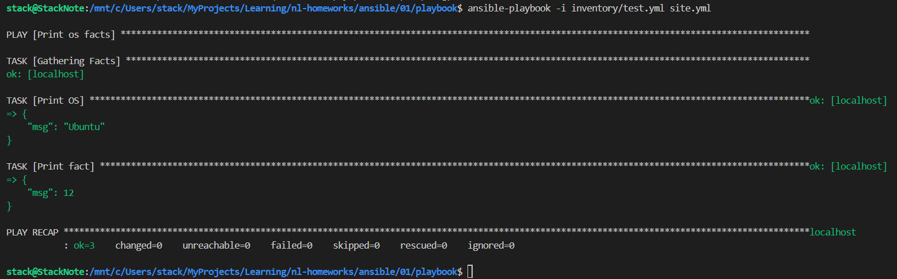
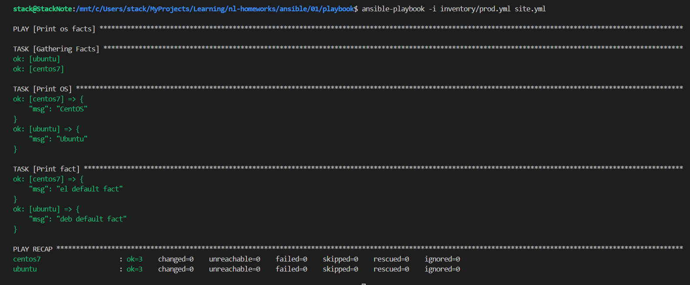
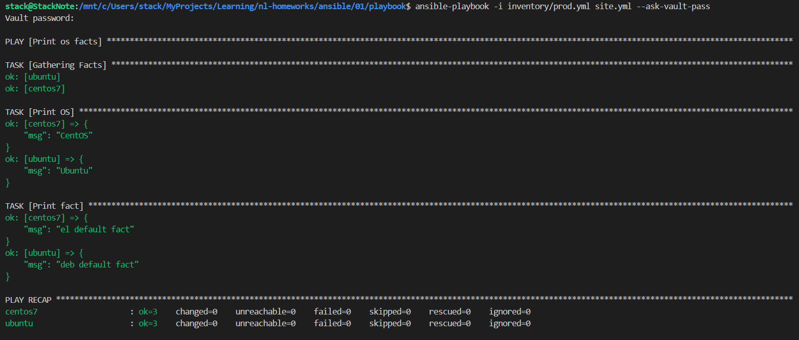
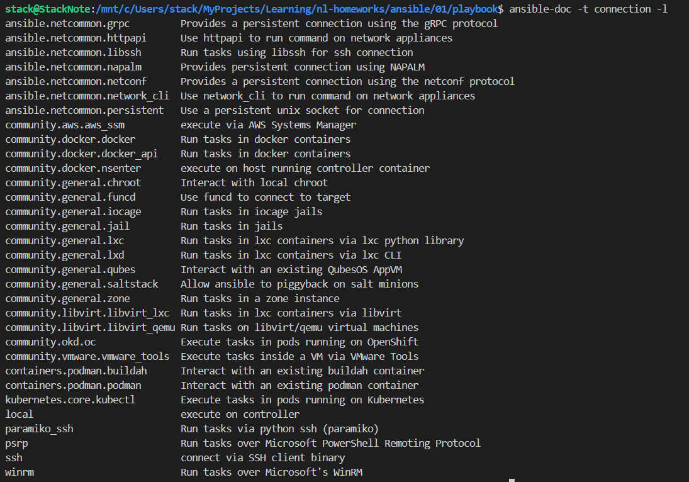
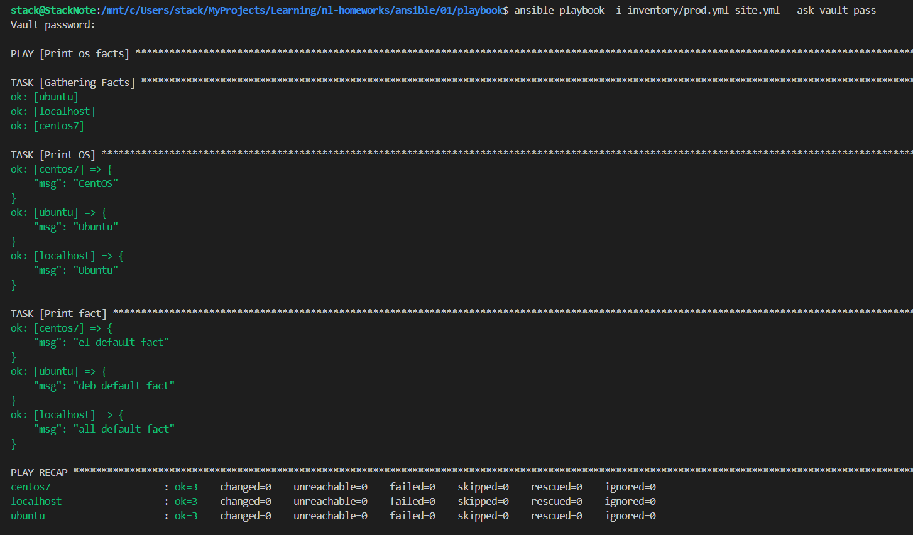

# Домашняя работа к занятию 1 «Введение в Ansible»

## Основная часть

```bash
ansible-playbook -i inventory/test.yml site.yml
# screen1
docker run -dit --name centos7 pycontribs/centos:7 sleep 6000000
docker run -dit --name ubuntu pycontribs/ubuntu:latest sleep 6000000

ansible-playbook -i inventory/prod.yml site.yml
# screen2
ansible-vault encrypt group_vars/deb/examp.yml group_vars/el/examp.yml
    New Vault password: 
    Confirm New Vault password: 
    Encryption successful
ansible-playbook -i inventory/prod.yml site.yml --ask-vault-pass
# screen 3
ansible-doc -t connection -l
# screen 4
ansible-playbook -i inventory/prod.yml site.yml --ask-vault-pass
# screen 5
```







## Опциональная часть

```bash
#optional
ansible-vault decrypt group_vars/deb/examp.yml group_vars/el/examp.yml
ansible-vault encrypt_string PaSSw0rd
ansible-playbook -i inventory/prod.yml site.yml --ask-vault-pass
# screen 6
 
```

script [start.sh](./start.sh)
