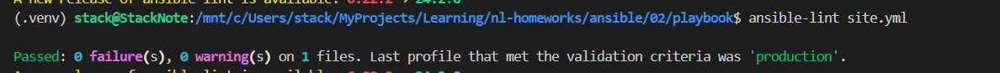

# Домашняя работа к занятию 2 «Работа с Playbook»

## Основная часть

Подготовлены tasks для установки clickhouse и vector [code](./playbook/site.yml)

```bash
# для ansible-lint необходим python3.9
sudo apt install python3.9
source ~/.venv/bin/activate
pip install ansible-lint
ansible-lint site.yml
```

Исправил ошибки.


```bash
ansible-playbook --private-key ~/.ssh/nl-ya-ed25519 -i inventory/prod.yml site.yml --check
```


```bash
ansible-playbook --private-key ~/.ssh/nl-ya-ed25519 -i inventory/prod.yml site.yml --diff
```


```bash
ansible-playbook --private-key ~/.ssh/nl-ya-ed25519 -i inventory/prod.yml site.yml --diff
```


[README.md-файл по playbook](./playbook/README.md).
