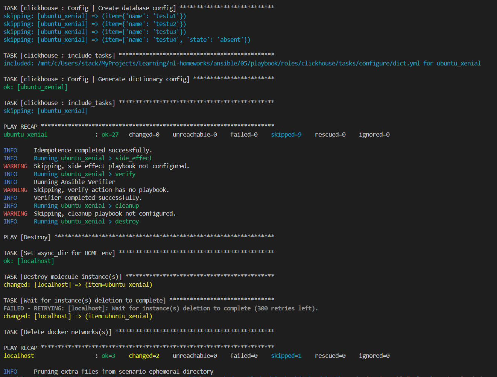
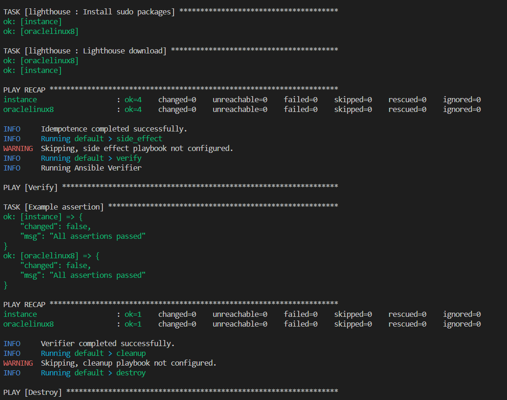

# Домашнее задание к занятию 5 «Тестирование roles»

```bash
pip3 install molecule molecule_docker molecule_podman
docker pull aragast/netology:latest

molecule test -s ubuntu_xenial

cd roles/vector
molecule init scenario --driver-name=docker
# change molecule/default/molecule.yml
molecule init scenario tox --driver-name=docker

molecule init scenario podman --driver-name=podman

```




