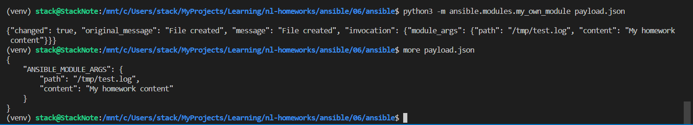
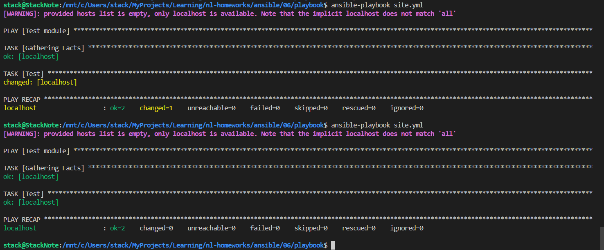
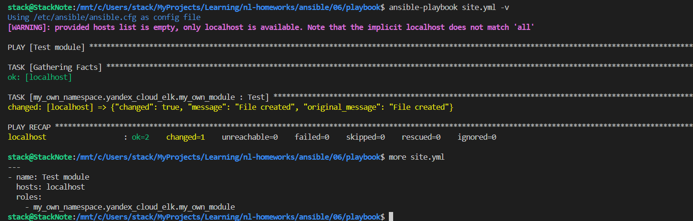

# Домашнее задание к занятию 6 «Создание собственных модулей»

```bash
# init venv
git clone https://github.com/ansible/ansible.git
cd ansible
python3 -m venv venv
. venv/bin/activate
pip install -r requirements.txt
. hacking/env-setup
deactivate
. venv/bin/activate && . hacking/env-setup

cd ansible/lib/ansible/modules/
# edit my_own_module.py
# check local module
python3 -m ansible.modules.my_own_module payload.json
#screen
ansible-playbook site.yml
#screen

# create collection
ansible-galaxy collection init my_own_namespace.yandex_cloud_elk
mkdir my_own_namespace/yandex_cloud_elk/plugins/modules
cp ../ansible/lib/ansible/modules/my_own_module.py my_own_namespace/yandex_cloud_elk/plugins/modules

cd my_own_namespace/yandex_cloud_elk
# create role
cd roles
ansible-galaxy role init my_own_module
# build package/module with role
ansible-galaxy collection build
# install package/module with role
ansible-galaxy collection install module/my_own_namespace-yandex_cloud_elk-1.0.0.tar.gz
# check
ansible-doc -l | grep my_own
# run
cd playbook
ansible-playbook site.yml -v
#screen

```

[code module](./module/)

[galaxy collection](./my_own_namespace/yandex_cloud_elk/)

[playbook](./playbook/)




