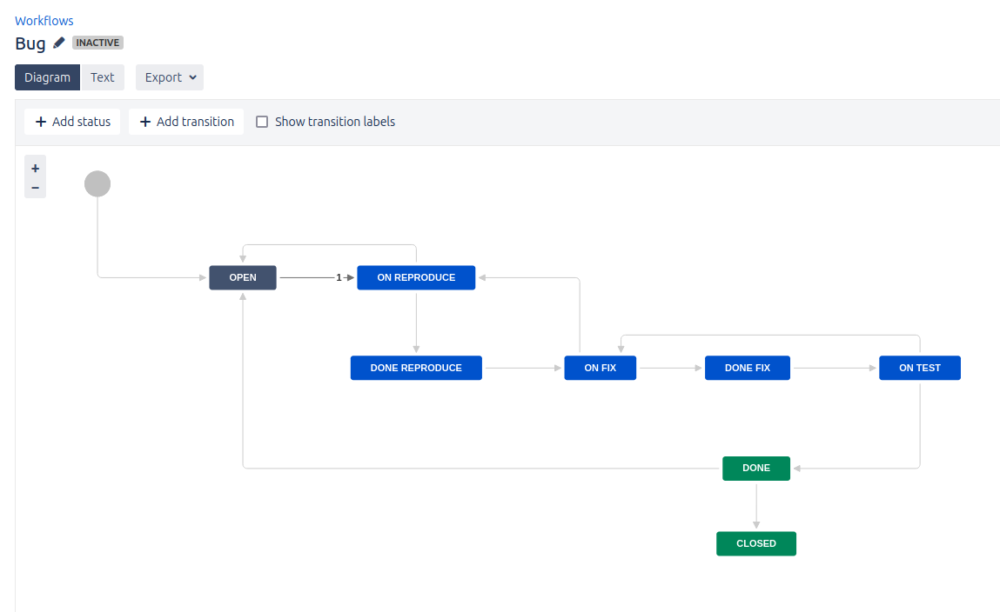

# Домашняя работа к занятию 7 «Жизненный цикл ПО»

## Подготовка к выполнению

Установлен [docker образ](https://hub.docker.com/r/atlassian/jira-software/#) и запущен на своем хосте.
Созданы доски Kanban и Scrum.

## Основная часть

Сделаны workflow

[Для задачи BUG](./Bug.xml)

[Для остальных типов задач](./All.xml)

Создание Epic

Трэкинг bug

Трэкинг других задач

