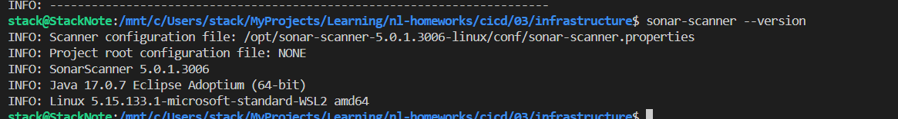

# Домашняя работа к занятию 9 «Процессы CI/CD»

## Подготовка к выполнению

```bash
ansible-playbook --private-key ~/.ssh/nl-ya-ed25519 -i inventory/cicd/hosts.yml site.yml 

export PATH=/opt/sonar-scanner-5.0.1.3006-linux/bin:$PATH
cd example
sonar-scanner   -Dsonar.projectKey=test-prj   -Dsonar.sources=.   -Dsonar.host.url=http://178.154.222.108:9000   -Dsonar.login=8c5110ab1d8f72d401083c935cad27d942a48126 -Dsonar.coverage.exclusions=fail.py -Dsonar.python.version=3 -Dsonar.scm.disabled=True

mvn --version
cd mvn
mvn package
```





[maven-metadata.xml](./data/maven-metadata.xml)

[pom.xml](./mvn/pom.xml)
