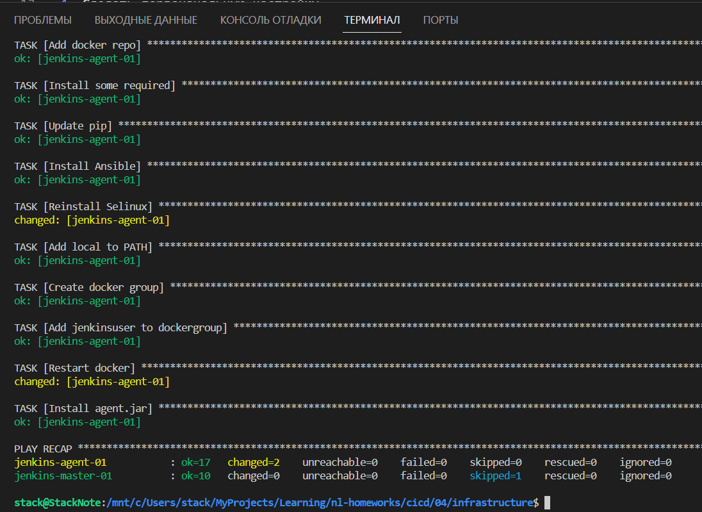
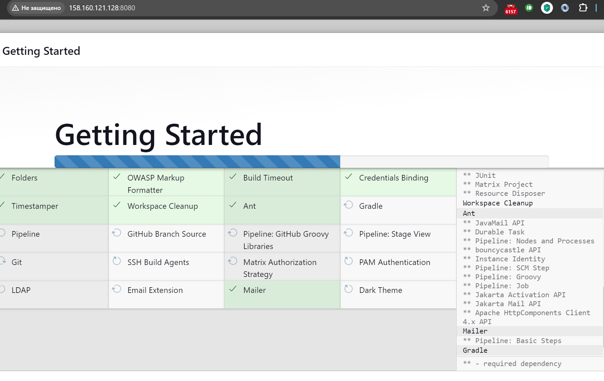
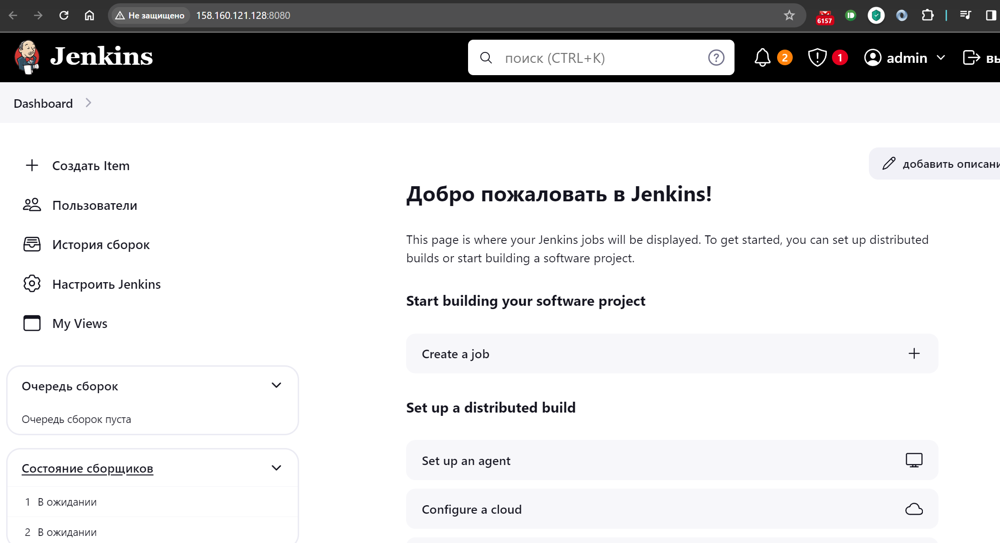
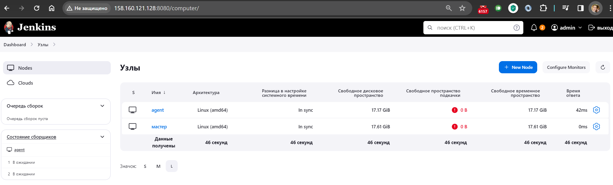
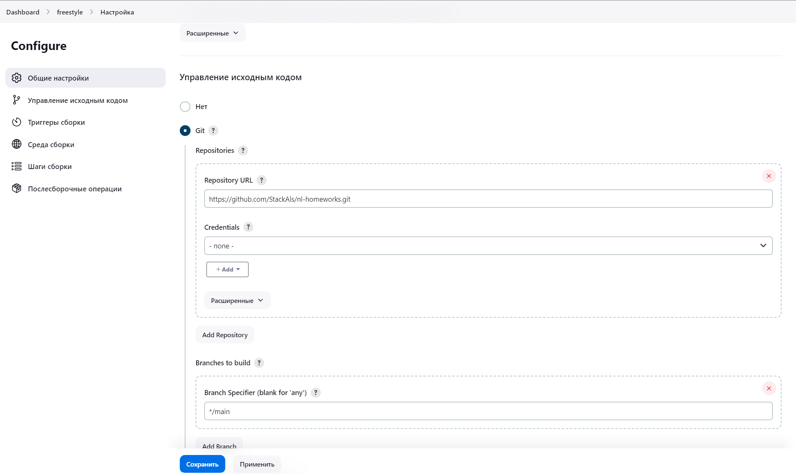
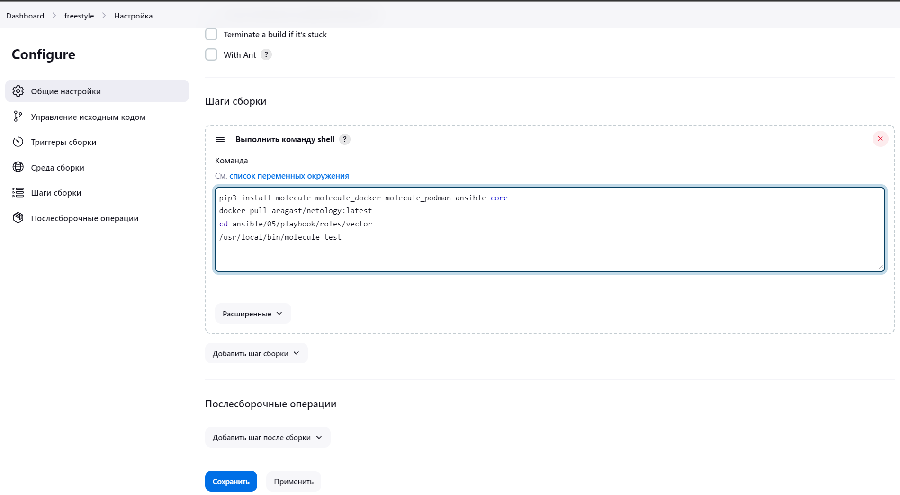
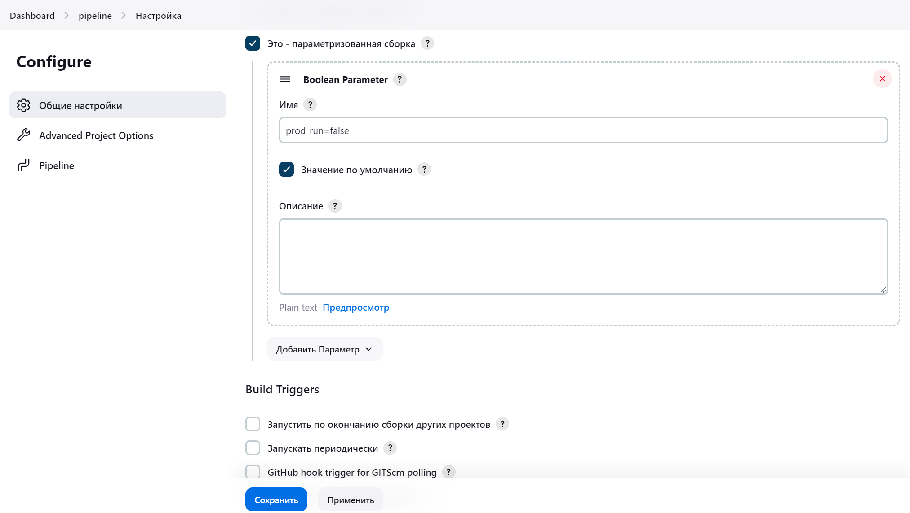
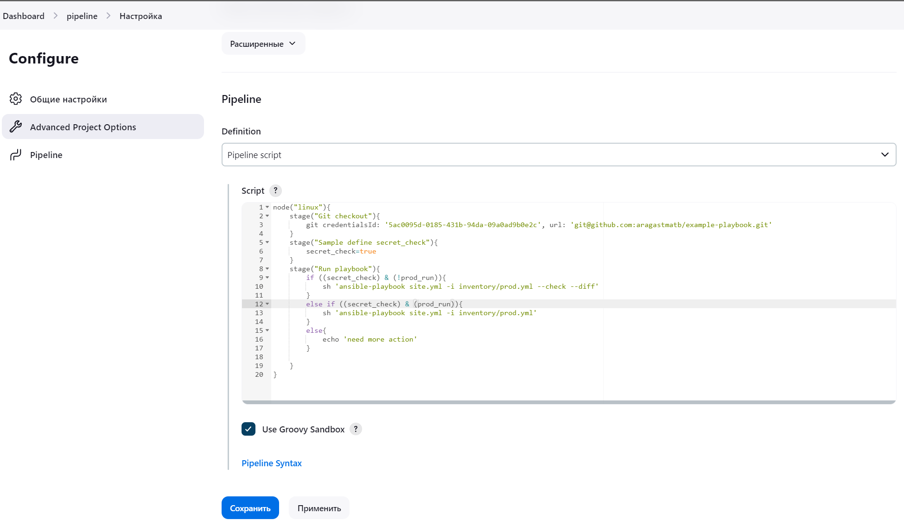

# Домашнее задание к занятию 10 «Jenkins»

```bash
ansible-playbook -i inventory/cicd/hosts.yml site.yml --private-key ~/.ssh/nl-ya-ed25519
ssh -i ~/.ssh/nl-ya-ed25519 admin@158.160.121.128
# read install key
sudo more /var/lib/jenkins/secrets/initialAdminPassword

```









