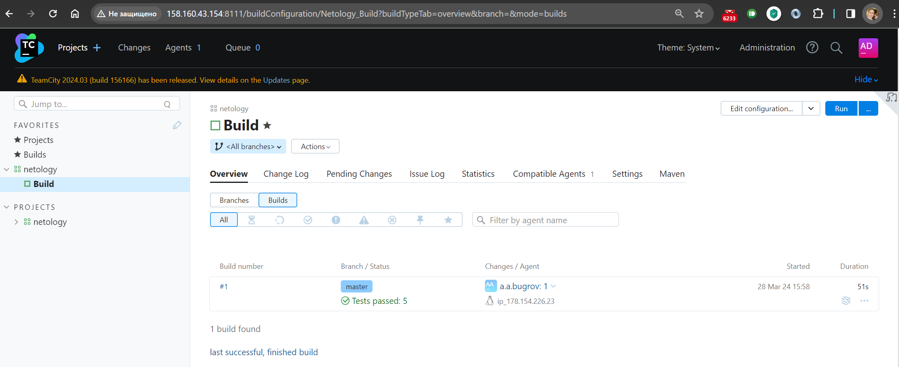
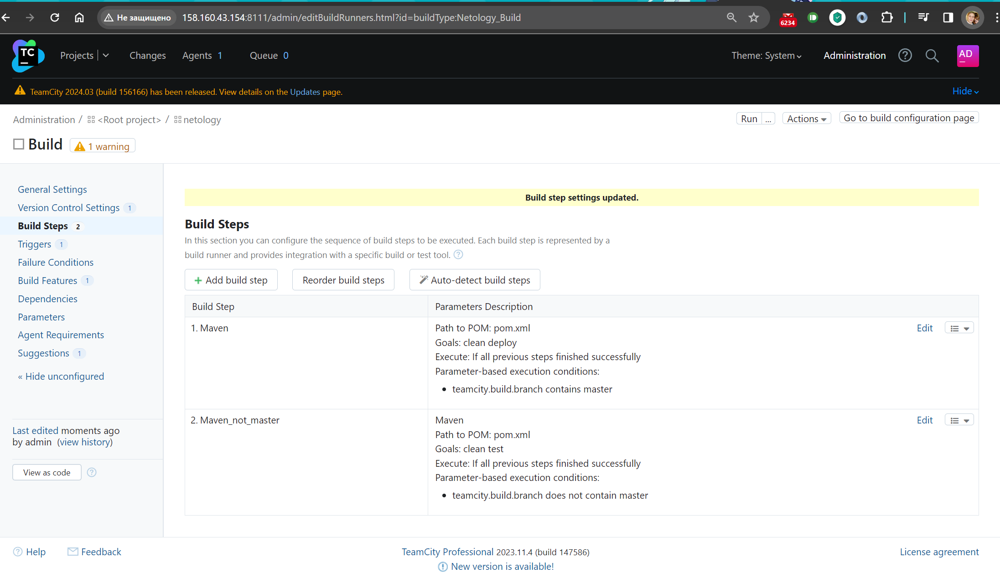
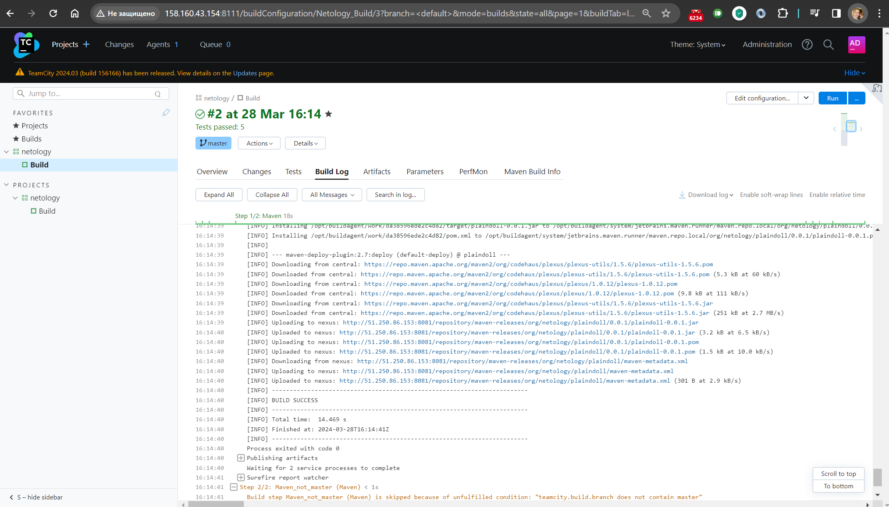
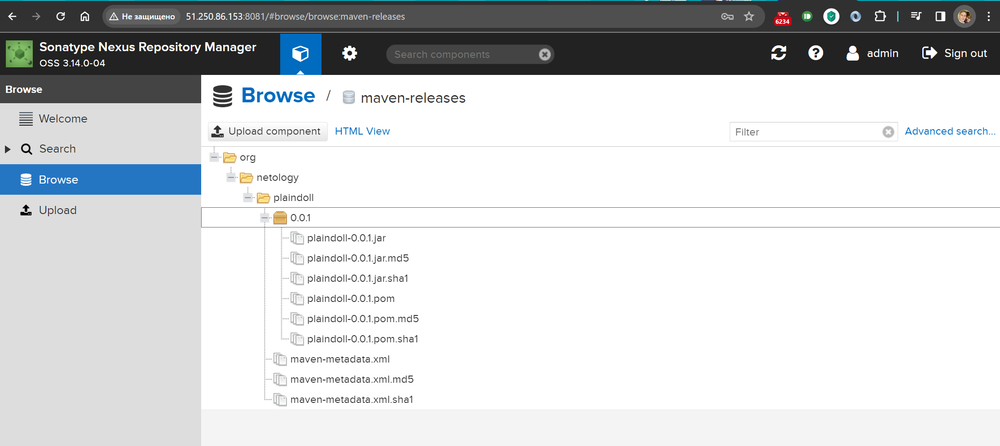
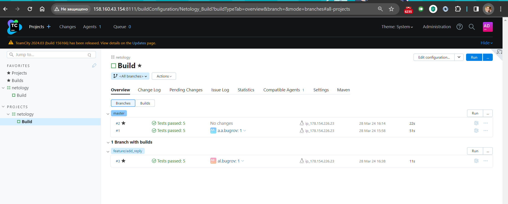
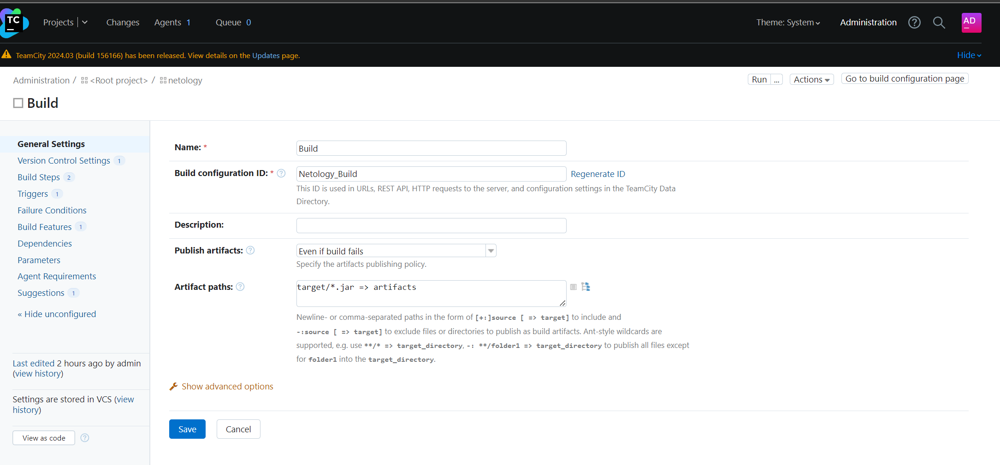
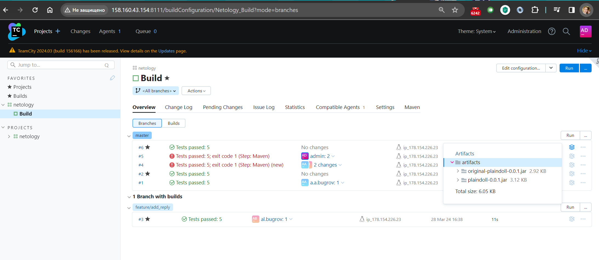

# Домашняя работа к занятию 11 «Teamcity»

[Repository fork](https://github.com/StackAls/nl-example-teamcity)

Сборки с `exit code1` были по причине наличия в Nexus артефактов с такими же данными.
