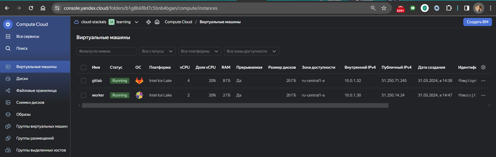
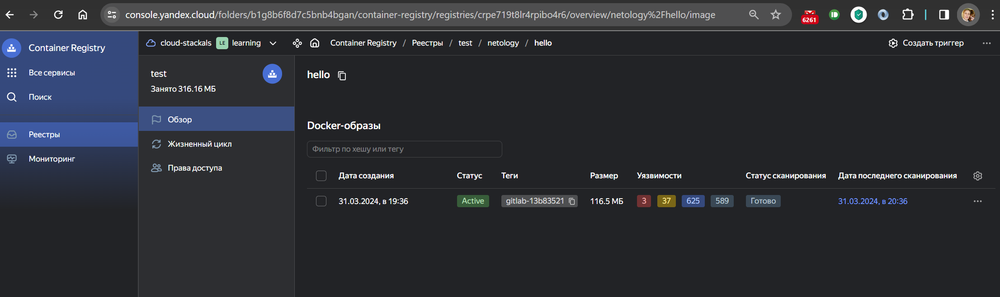

# Домашняя работа к занятию 12 «GitLab»

Cоздана виртуальная машина gitlab из публичного образа [по инструкции](https://cloud.yandex.ru/marketplace/products/yc/gitlab).
Создана виртуальная машина worker - centos7 с gitlab-runner [по инструкции](https://docs.gitlab.com/runner/install/linux-repository.html)
Сделаны дополнительные настройки на worker [по инструкции](https://docs.gitlab.com/ee/ci/docker/using_docker_build.html)
[Добавлены файлы](./repo/) в проект на сервер gitlab.
В настройках CI/CD указан регистри Яндекса.

[Проверен билд проекта и отправка в регистри.](./screen/Screenshot2024-03-31-201854.png)

[Создано Issue  на доработку проекта.](./screen/Screenshot2024-03-31-152355.png)

[Создан Merge request](./screen/Screenshot2024-03-31-211407.png)

[Протестировано изменение](./screen/Screenshot2024-03-31-212716.png)

Issue закрыто

[Лог пайплайна](./repo/job.log)
