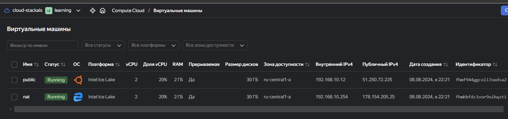

# Домашняя работа к занятию «Организация сети»

## Подготовка к выполнению задания

1. Домашнее задание состоит из обязательной части, которую нужно выполнить на провайдере Yandex Cloud, и дополнительной части в AWS (выполняется по желанию).
2. Все домашние задания в блоке 15 связаны друг с другом и в конце представляют пример законченной инфраструктуры.  
3. Все задания нужно выполнить с помощью Terraform. Результатом выполненного домашнего задания будет код в репозитории.
4. Перед началом работы настройте доступ к облачным ресурсам из Terraform, используя материалы прошлых лекций и домашнее задание по теме «Облачные провайдеры и синтаксис Terraform». Заранее выберите регион (в случае AWS) и зону.

---

## Задание 1. Yandex Cloud

**Что нужно сделать**

1. Создать пустую VPC. Выбрать зону.
2. Публичная подсеть.

- Создать в VPC subnet с названием public, сетью 192.168.10.0/24.
- Создать в этой подсети NAT-инстанс, присвоив ему адрес 192.168.10.254. В качестве image_id использовать fd80mrhj8fl2oe87o4e1.
- Создать в этой публичной подсети виртуалку с публичным IP, подключиться к ней и убедиться, что есть доступ к интернету.

3. Приватная подсеть.

- Создать в VPC subnet с названием private, сетью 192.168.20.0/24.
- Создать route table. Добавить статический маршрут, направляющий весь исходящий трафик private сети в NAT-инстанс.
- Создать в этой приватной подсети виртуалку с внутренним IP, подключиться к ней через виртуалку, созданную ранее, и убедиться, что есть доступ к интернету.

Resource Terraform для Yandex Cloud:

- [VPC subnet](https://registry.terraform.io/providers/yandex-cloud/yandex/latest/docs/resources/vpc_subnet).
- [Route table](https://registry.terraform.io/providers/yandex-cloud/yandex/latest/docs/resources/vpc_route_table).
- [Compute Instance](https://registry.terraform.io/providers/yandex-cloud/yandex/latest/docs/resources/compute_instance).

---

## Ответ на задание 1

Создаю конфигурацию для [terraform](./tfm/) с одной подсетью public и одной ВМ public и NAT-инстанс.

Документация по [NAT-инстанс](https://yandex.cloud/ru/docs/tutorials/routing/nat-instance)

Проверяю доступ в интернет с ВМ public.

```bash
cd tfm

# применяю terraform
terraform init
terraform validate
terraform fmt
terraform plan
terraform apply -auto-approve

# проверка
ssh -i ~/.ssh/nl-ya-ed25519 ubuntu@51.250.72.225
curl -I https://ya.ru
```





Добавляю подсеть private, таблицу маршрутизации route_nat и ВМ private [terraform](./tfm/).
Проверяю доступ в интернет с ВМ private.

```bash
resource "yandex_vpc_subnet" "private" {
  network_id     = yandex_vpc_network.network.id
  name           = var.vpc_private
  zone           = var.default_zone
  v4_cidr_blocks = var.vpc_private_cidr
  route_table_id = yandex_vpc_route_table.route_nat.id
}

resource "yandex_vpc_route_table" "route_nat" {
  network_id = yandex_vpc_network.network.id

  static_route {
    destination_prefix = "0.0.0.0/0"
    next_hop_address   = var.vm_nat_ip_address
  }

}
```


---

## Задание 2. AWS* (задание со звёздочкой)

Это необязательное задание. Его выполнение не влияет на получение зачёта по домашней работе.

**Что нужно сделать**

1. Создать пустую VPC с подсетью 10.10.0.0/16.
2. Публичная подсеть.

- Создать в VPC subnet с названием public, сетью 10.10.1.0/24.
- Разрешить в этой subnet присвоение public IP по-умолчанию.
- Создать Internet gateway.
- Добавить в таблицу маршрутизации маршрут, направляющий весь исходящий трафик в Internet gateway.
- Создать security group с разрешающими правилами на SSH и ICMP. Привязать эту security group на все, создаваемые в этом ДЗ, виртуалки.
- Создать в этой подсети виртуалку и убедиться, что инстанс имеет публичный IP. Подключиться к ней, убедиться, что есть доступ к интернету.
- Добавить NAT gateway в public subnet.

3. Приватная подсеть.

- Создать в VPC subnet с названием private, сетью 10.10.2.0/24.
- Создать отдельную таблицу маршрутизации и привязать её к private подсети.
- Добавить Route, направляющий весь исходящий трафик private сети в NAT.
- Создать виртуалку в приватной сети.
- Подключиться к ней по SSH по приватному IP через виртуалку, созданную ранее в публичной подсети, и убедиться, что с виртуалки есть выход в интернет.

Resource Terraform:

1. [VPC](https://registry.terraform.io/providers/hashicorp/aws/latest/docs/resources/vpc).
1. [Subnet](https://registry.terraform.io/providers/hashicorp/aws/latest/docs/resources/subnet).
1. [Internet Gateway](https://registry.terraform.io/providers/hashicorp/aws/latest/docs/resources/internet_gateway).

### Правила приёма работы

Домашняя работа оформляется в своём Git репозитории в файле README.md. Выполненное домашнее задание пришлите ссылкой на .md-файл в вашем репозитории.
Файл README.md должен содержать скриншоты вывода необходимых команд, а также скриншоты результатов.
Репозиторий должен содержать тексты манифестов или ссылки на них в файле README.md.
