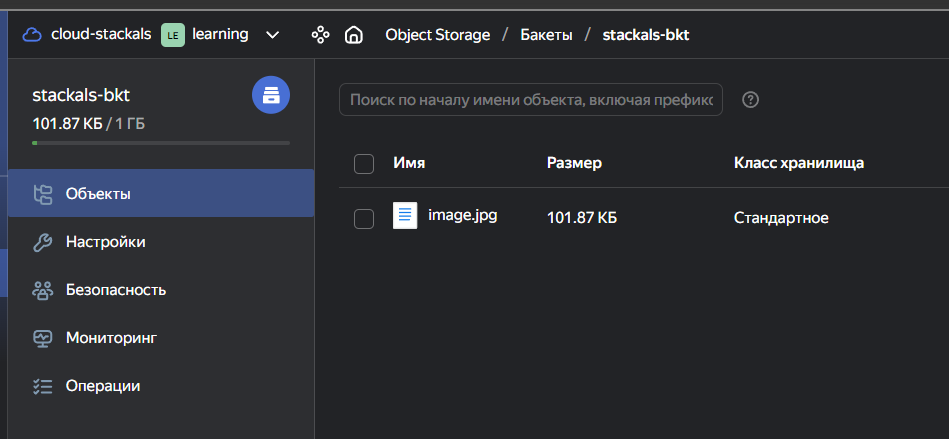
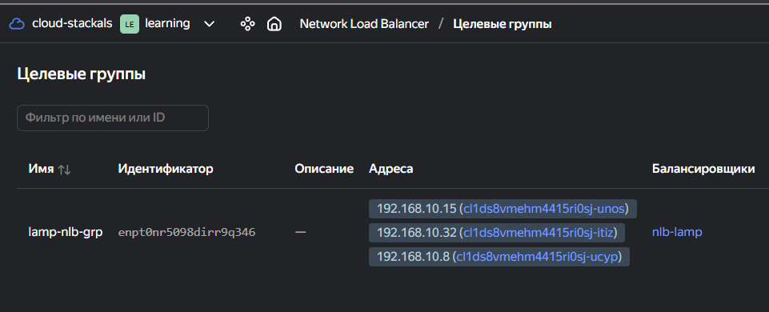
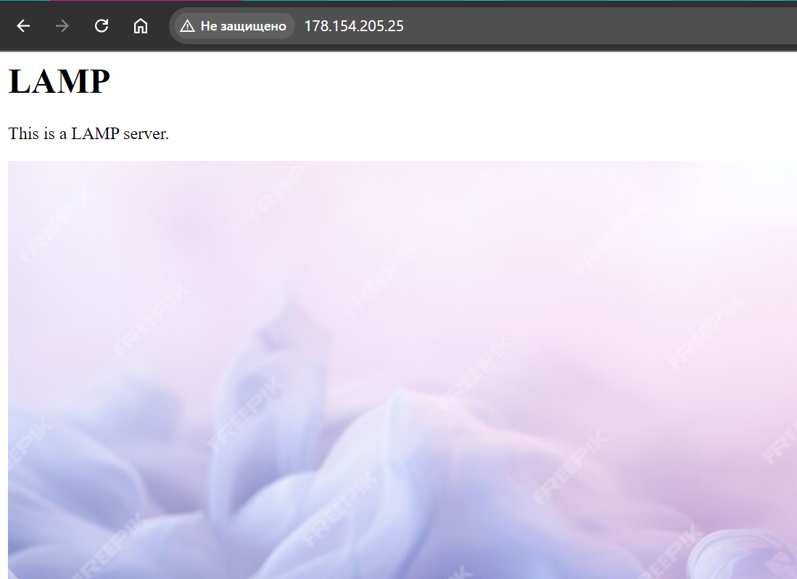
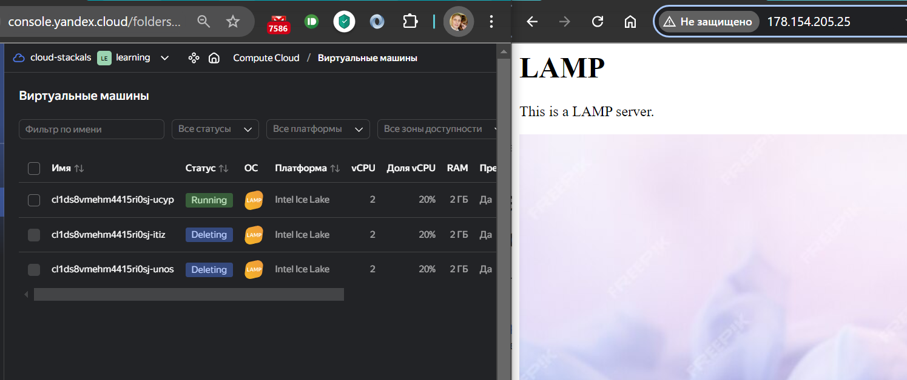
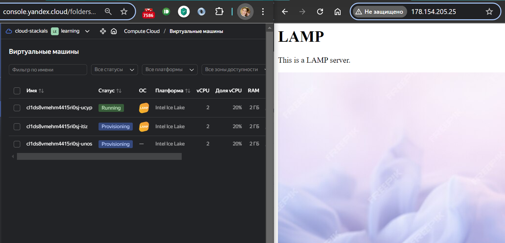
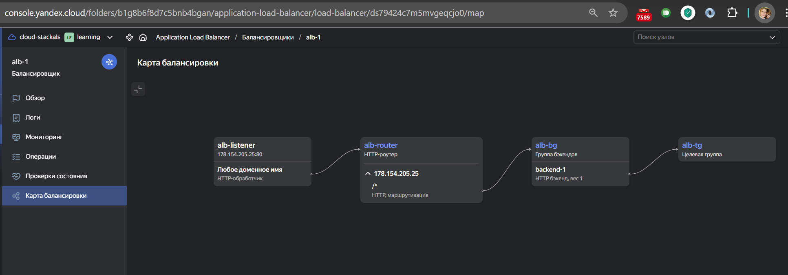

# Домашняя работа к занятию «Вычислительные мощности. Балансировщики нагрузки»  

### Подготовка к выполнению задания

1. Домашнее задание состоит из обязательной части, которую нужно выполнить на провайдере Yandex Cloud, и дополнительной части в AWS (выполняется по желанию).
2. Все домашние задания в блоке 15 связаны друг с другом и в конце представляют пример законченной инфраструктуры.
3. Все задания нужно выполнить с помощью Terraform. Результатом выполненного домашнего задания будет код в репозитории.
4. Перед началом работы настройте доступ к облачным ресурсам из Terraform, используя материалы прошлых лекций и домашних заданий.

---

## Задание 1. Yandex Cloud

**Что нужно сделать**

1. Создать бакет Object Storage и разместить в нём файл с картинкой:

- Создать бакет в Object Storage с произвольным именем (например, _имя_студента_дата_).
- Положить в бакет файл с картинкой.
- Сделать файл доступным из интернета.

2. Создать группу ВМ в public подсети фиксированного размера с шаблоном LAMP и веб-страницей, содержащей ссылку на картинку из бакета:

- Создать Instance Group с тремя ВМ и шаблоном LAMP. Для LAMP рекомендуется использовать `image_id = fd827b91d99psvq5fjit`.
- Для создания стартовой веб-страницы рекомендуется использовать раздел `user_data` в [meta_data](https://cloud.yandex.ru/docs/compute/concepts/vm-metadata).
- Разместить в стартовой веб-странице шаблонной ВМ ссылку на картинку из бакета.
- Настроить проверку состояния ВМ.

3. Подключить группу к сетевому балансировщику:

- Создать сетевой балансировщик.
- Проверить работоспособность, удалив одну или несколько ВМ.

4. (дополнительно)* Создать Application Load Balancer с использованием Instance group и проверкой состояния.

Полезные документы:

- [Compute instance group](https://registry.terraform.io/providers/yandex-cloud/yandex/latest/docs/resources/compute_instance_group).
- [Network Load Balancer](https://registry.terraform.io/providers/yandex-cloud/yandex/latest/docs/resources/lb_network_load_balancer).
- [Группа ВМ с сетевым балансировщиком](https://cloud.yandex.ru/docs/compute/operations/instance-groups/create-with-balancer).

---

### Ответ на задание 1

Документация по S3
    - [Создание бакета](https://yandex.cloud/ru/docs/storage/operations/buckets/create)
    - [Загрузка объекта](https://yandex.cloud/ru/docs/storage/operations/objects/upload) через terraform.
    - Так же необходимо дать публичный доступ к объекту, по умолчанию доступ private [acl](https://github.com/yandex-cloud/docs/blob/master/en/_includes/storage/security/acl.md)

Создаю [код для terraform](./tfm/) для этого задания

Код создания бакета и объекта [s3storage.tf](./tfm/s3storage.tf) и его переменные [variables_s3.tf](./tfm/variables_s3.tf)

В результате создаётся бакет и в него загружается файл.



Создаю Network Load Balancer

Документация по созданию ВМ c LAMP стеком и NLB
    - [Установка LAMP](https://yandex.cloud/ru/docs/tutorials/web/lamp-lemp/terraform)
    - [Пользовательский init скрипт](https://yandex.cloud/ru/docs/compute/operations/vm-create/create-with-cloud-init-scripts)
    - [Создание NLB](https://yandex.cloud/ru/docs/tutorials/web/load-balancer-website)

Код создания
    - NLB [nlb.tf](./tfm/nlb.tf)
    - Группы размещения [vm_grp_lamp.tf](./tfm/vm_grp_lamp.tf)
    - Конфигурация ВМ [cloud-init.yml](./tfm/cloud-init.yml)

Применение этого кода создаёт три VM и NLB



Открываю браузер с ip NLB [http://178.154.205.25/](http://178.154.205.25/)



Удаляю две ВМ. Страница по прежнему доступна.



Спустя некоторое время удаленные ВМ автоматически вновь создаются.



Теперь создаю Application Load Balancer (ALB)

[Документация по созданию ALB](https://yandex.cloud/ru/docs/tutorials/web/application-load-balancer-website)

Использую ту же группу ВМ. Одновременно использовать NLB и ALB с одной и той же группой нельзя.
Поэтому комментирую код [vm_grp_lamp.tf](./tfm/vm_grp_lamp.tf)

```bash

  # load_balancer {
  #   target_group_name = "lamp-nlb-grp"
  # }

  application_load_balancer {
    target_group_name = "alb-tg"
  }
```

Код создания ALB [alb.tf](./tfm/alb.tf)



---

## Задание 2*. AWS (задание со звёздочкой)

Это необязательное задание. Его выполнение не влияет на получение зачёта по домашней работе.

**Что нужно сделать**

Используя конфигурации, выполненные в домашнем задании из предыдущего занятия, добавить к Production like сети Autoscaling group из трёх EC2-инстансов с  автоматической установкой веб-сервера в private домен.

1. Создать бакет S3 и разместить в нём файл с картинкой:

- Создать бакет в S3 с произвольным именем (например, _имя_студента_дата_).
- Положить в бакет файл с картинкой.
- Сделать доступным из интернета.

2. Сделать Launch configurations с использованием bootstrap-скрипта с созданием веб-страницы, на которой будет ссылка на картинку в S3.
3. Загрузить три ЕС2-инстанса и настроить LB с помощью Autoscaling Group.

Resource Terraform:

- [S3 bucket](https://registry.terraform.io/providers/hashicorp/aws/latest/docs/resources/s3_bucket)
- [Launch Template](https://registry.terraform.io/providers/hashicorp/aws/latest/docs/resources/launch_template).
- [Autoscaling group](https://registry.terraform.io/providers/hashicorp/aws/latest/docs/resources/autoscaling_group).
- [Launch configuration](https://registry.terraform.io/providers/hashicorp/aws/latest/docs/resources/launch_configuration).

Пример bootstrap-скрипта:

```bash
#!/bin/bash
yum install httpd -y
service httpd start
chkconfig httpd on
cd /var/www/html
echo "<html><h1>My cool web-server</h1></html>" > index.html
```

### Правила приёма работы

Домашняя работа оформляется в своём Git репозитории в файле README.md. Выполненное домашнее задание пришлите ссылкой на .md-файл в вашем репозитории.
Файл README.md должен содержать скриншоты вывода необходимых команд, а также скриншоты результатов.
Репозиторий должен содержать тексты манифестов или ссылки на них в файле README.md.
