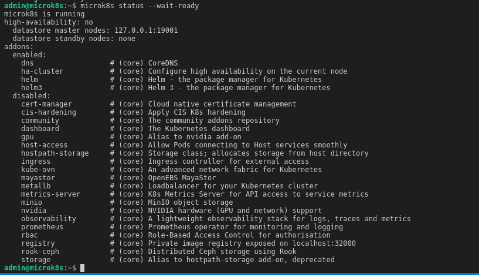
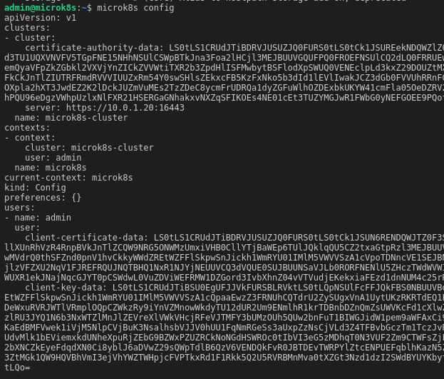
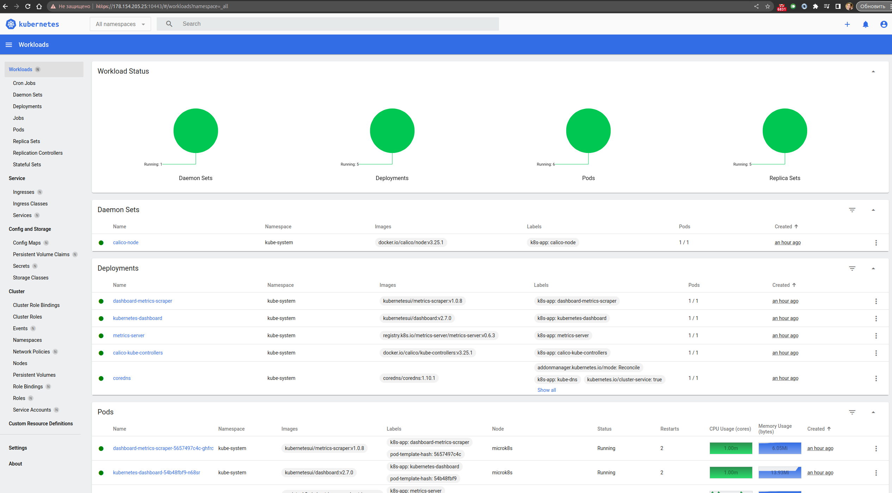
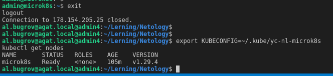

# Домашняя работа к занятию «Kubernetes. Причины появления. Команда kubectl»

## Цель задания

Для экспериментов и валидации ваших решений вам нужно подготовить тестовую среду для работы с Kubernetes. Оптимальное решение — развернуть на рабочей машине или на отдельной виртуальной машине MicroK8S.

---

## Инструменты и дополнительные материалы, которые пригодятся для выполнения задания

1. [Инструкция](https://microk8s.io/docs/getting-started) по установке MicroK8S.
2. [Инструкция](https://kubernetes.io/ru/docs/reference/kubectl/cheatsheet/#bash) по установке автодополнения **kubectl**.
3. [Шпаргалка](https://kubernetes.io/ru/docs/reference/kubectl/cheatsheet/) по **kubectl**.

---

## Подготовка

### На клиенте - Установка kubectl

```bash

curl -LO "https://dl.k8s.io/release/$(curl -L -s https://dl.k8s.io/release/stable.txt)/bin/linux/amd64/kubectl"
sudo install -o root -g root -m 0755 kubectl /usr/local/bin/kubectl
kubectl version --client
echo 'source <(kubectl completion bash)' >>~/.bashrc

```

### На сервере - Установка microk8s

```bash

    ssh -i ~/.ssh/yc-iaac admin@178.154.205.25

    sudo apt update
    sudo apt install snapd
    sudo snap install microk8s --classic
    sudo usermod -a -G microk8s $USER
    sudo chown -f -R $USER ~/.kube

```

## Проверка

### На сервере

```bash

    # проверить статус
    microk8s status --wait-ready
    # подключиться к microK8s и получить информацию можно через команду `microk8s command`, например
    microk8s kubectl get nodes
    
    # добавляем dashboard
    # список addon
    microk8s status
    # включить addon dashboard
    microk8s enable dashboard
    # токен доступа в dashboard
    microk8s kubectl create token default

    # вывод конфигурации
    microk8s config
    # копируем конфиг на клиента
    microk8s config > yc-nl-microk8s
    # проброс порта
    microk8s kubectl port-forward -n kube-system service/kubernetes-dashboard 10443:443 --address 0.0.0.0

```





## Настройка внешнего подключения

### На сервере

```bash

    # отредактировать файл 
    nano /var/snap/microk8s/current/certs/csr.conf.template

    #[ alt_names ]
    # Add
    IP.3 = 178.154.205.25

    # обновить сертификаты 
    sudo microk8s refresh-certs --cert front-proxy-client.crt

```

### На клиенте

```bash

export KUBECONFIG=~/.kube/yc-nl-microk8s
kubectl get nodes

```




