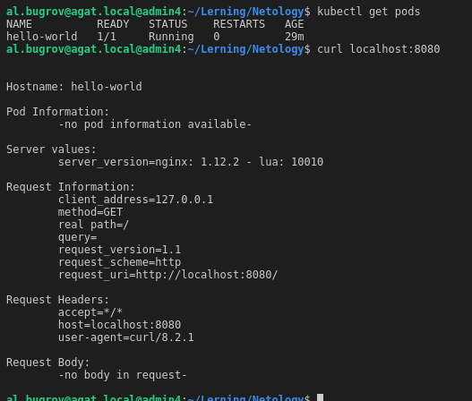
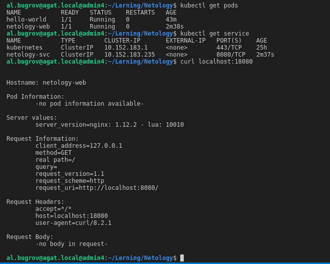

# Домашняя работа к занятию «Базовые объекты K8S»

### Цель задания

В тестовой среде для работы с Kubernetes, установленной в предыдущем ДЗ, необходимо развернуть Pod с приложением и подключиться к нему со своего локального компьютера.

### Инструменты и дополнительные материалы, которые пригодятся для выполнения задания

1. Описание [Pod](https://kubernetes.io/docs/concepts/workloads/pods/) и примеры манифестов.
2. Описание [Service](https://kubernetes.io/docs/concepts/services-networking/service/).

------

### Задание 1. Создать Pod с именем hello-world

1. Создать манифест (yaml-конфигурацию) Pod.
2. Использовать image - gcr.io/kubernetes-e2e-test-images/echoserver:2.2.
3. Подключиться локально к Pod с помощью `kubectl port-forward` и вывести значение (curl или в браузере).

### Ответ Задание 1

Файл конфигурации pod [hello-world.yml](./app/hello-world.yml)

```bash
# на клиенте
export KUBECONFIG=~/.kube/yc-nl-microk8s
kubectl apply -f hello-world.yml
kubectl port-forward -n default hello-world 8080:8080

```



------

### Задание 2. Создать Service и подключить его к Pod

1. Создать Pod с именем netology-web.
2. Использовать image — gcr.io/kubernetes-e2e-test-images/echoserver:2.2.
3. Создать Service с именем netology-svc и подключить к netology-web.
4. Подключиться локально к Service с помощью `kubectl port-forward` и вывести значение (curl или в браузере).

### Ответ Задание 2

Файл конфигурации pod [netology-web.yml](./app/netology-web.yml)

Файл конфигурации service [netology-svc.yml](./app/netology-svc.yml)

```bash
# на клиенте
export KUBECONFIG=~/.kube/yc-nl-microk8s
kubectl apply -f netology-web.yml
kubectl apply -f netology-svc.yml
kubectl get pods
kubectl get service
kubectl port-forward -n default services/netology-svc 18080:8080

```


