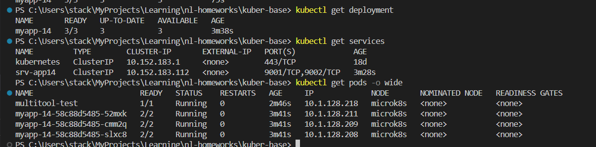
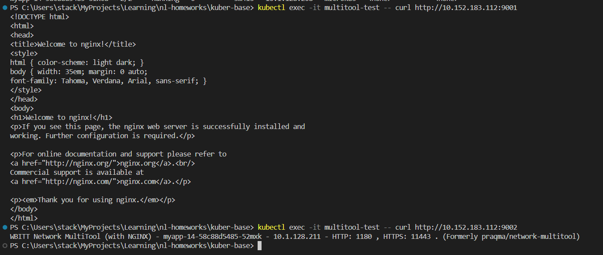
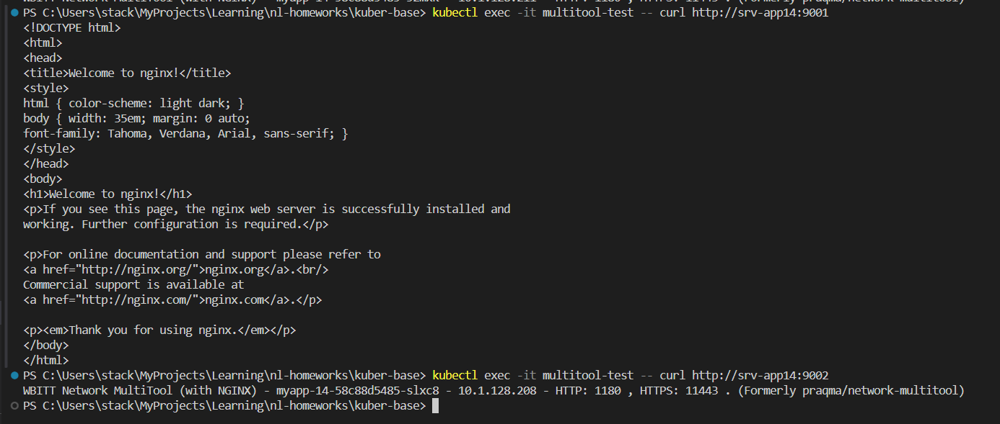
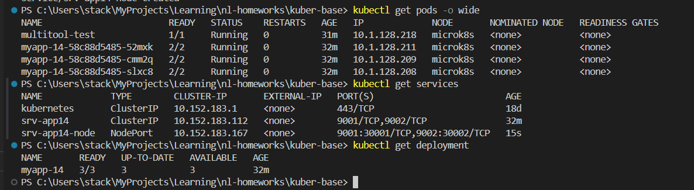
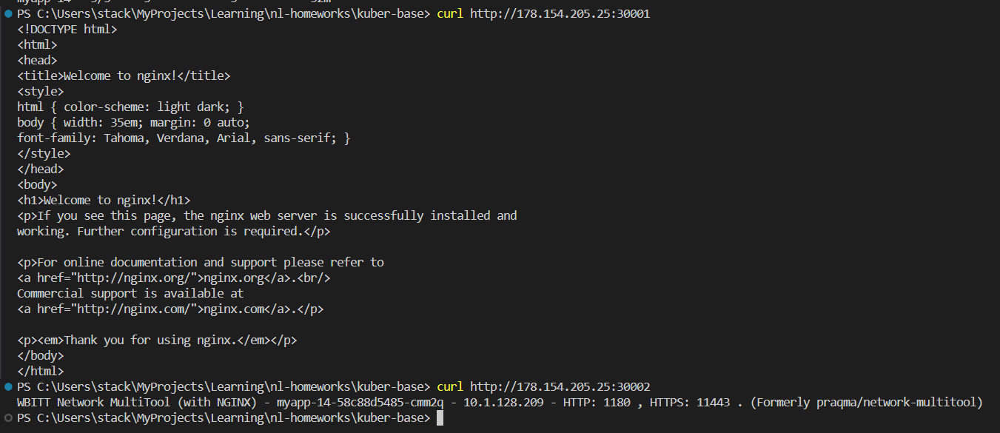

# Домашняя работа к занятию «Сетевое взаимодействие в K8S. Часть 1»

## Цель задания

В тестовой среде Kubernetes необходимо обеспечить доступ к приложению, установленному в предыдущем ДЗ и состоящему из двух контейнеров, по разным портам в разные контейнеры как внутри кластера, так и снаружи.

------

## Инструменты и дополнительные материалы, которые пригодятся для выполнения задания

1. [Описание](https://kubernetes.io/docs/concepts/workloads/controllers/deployment/) Deployment и примеры манифестов.
2. [Описание](https://kubernetes.io/docs/concepts/services-networking/service/) Описание Service.
3. [Описание](https://github.com/wbitt/Network-MultiTool) Multitool.

------

## Задание 1. Создать Deployment и обеспечить доступ к контейнерам приложения по разным портам из другого Pod внутри кластера

1. Создать Deployment приложения, состоящего из двух контейнеров (nginx и multitool), с количеством реплик 3 шт.
2. Создать Service, который обеспечит доступ внутри кластера до контейнеров приложения из п.1 по порту 9001 — nginx 80, по 9002 — multitool 8080.
3. Создать отдельный Pod с приложением multitool и убедиться с помощью `curl`, что из пода есть доступ до приложения из п.1 по разным портам в разные контейнеры.
4. Продемонстрировать доступ с помощью `curl` по доменному имени сервиса.
5. Предоставить манифесты Deployment и Service в решении, а также скриншоты или вывод команды п.4.

------

### Ответ на задание 1

1. Разворачиваю Deployment

```bash
# приложение
kubectl apply -f app/deployment.yml

# сервис
kubectl apply -f app/service.yml

# отдельный под
kubectl apply -f app/multi.yml

# проверка
kubectl get deployment
kubectl get services
kubectl get pods -o wide

# смотрим логи
kubectl logs deployments/myapp-14 -c nginx
kubectl logs deployments/myapp-14 -c multitool

# проверка сетевой связности
# по IP
kubectl exec -it multitool-test -- curl http://10.152.183.112:9001
kubectl exec -it multitool-test -- curl http://10.152.183.112:9002
# по имени
kubectl exec -it multitool-test -- curl http://srv-app14:9001
kubectl exec -it multitool-test -- curl http://srv-app14:9002

```

[deployment.yml](./app/deployment.yml)

[service.yml](./app/service.yml)

[Pod multi.yml](./app/multi.yml)







------

### Задание 2. Создать Service и обеспечить доступ к приложениям снаружи кластера

1. Создать отдельный Service приложения из Задания 1 с возможностью доступа снаружи кластера к nginx, используя тип NodePort.
2. Продемонстрировать доступ с помощью браузера или `curl` с локального компьютера.
3. Предоставить манифест и Service в решении, а также скриншоты или вывод команды п.2.

------

### Ответ на задание 2

```bash
# добавляю ещё один сервис с node_ports
kubectl apply -f app/node_ports.yml

# проверяю
kubectl get deployment
kubectl get services
kubectl get pods -o wide

# проверка сетевой связности
# по IP кластера с локальной машины
# в настройках группы безопасносли YandexCloud открыть порты 30001-30002
curl http://178.154.205.25:30001
curl http://178.154.205.25:30002

```

[node_ports.yml](./app/node_ports.yml)




