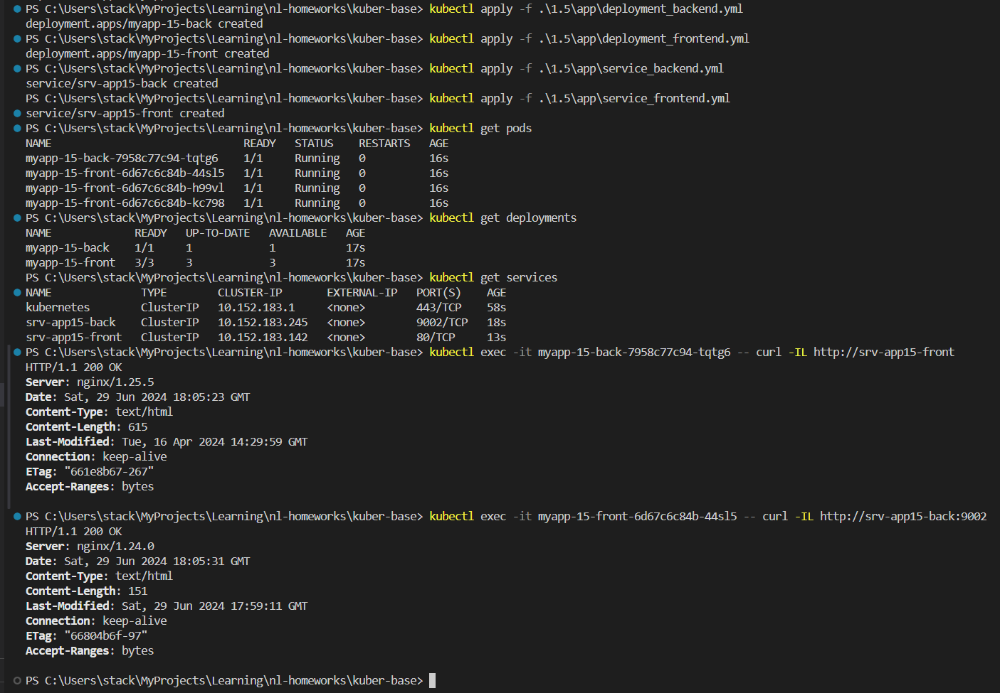
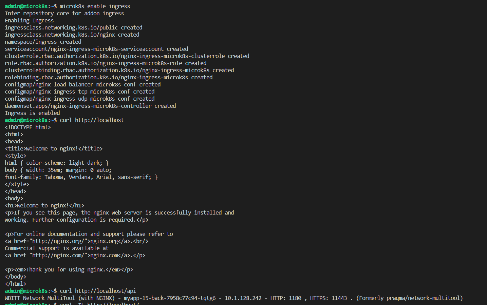
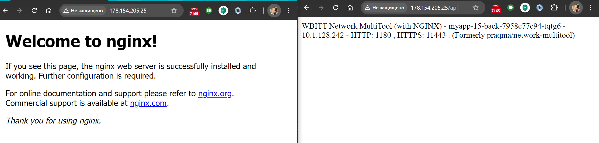

# Домашняя работа к занятию «Сетевое взаимодействие в K8S. Часть 2»

## Цель задания

В тестовой среде Kubernetes необходимо обеспечить доступ к двум приложениям снаружи кластера по разным путям.

------

## Инструменты и дополнительные материалы, которые пригодятся для выполнения задания

1. [Инструкция](https://microk8s.io/docs/getting-started) по установке MicroK8S.
2. [Описание](https://kubernetes.io/docs/concepts/services-networking/service/) Service.
3. [Описание](https://kubernetes.io/docs/concepts/services-networking/ingress/) Ingress.
4. [Описание](https://github.com/wbitt/Network-MultiTool) Multitool.

------

### Задание 1. Создать Deployment приложений backend и frontend

1. Создать Deployment приложения _frontend_ из образа nginx с количеством реплик 3 шт.
2. Создать Deployment приложения _backend_ из образа multitool.
3. Добавить Service, которые обеспечат доступ к обоим приложениям внутри кластера.
4. Продемонстрировать, что приложения видят друг друга с помощью Service.
5. Предоставить манифесты Deployment и Service в решении, а также скриншоты или вывод команды п.4.

------

### Ответ на задание 1

Создал файлы:

[deployment_backend.yml](./app/deployment_backend.yml)

[deployment_frontend.yml](./app/deployment_frontend.yml)

[service_backend.yml](./app/service_backend.yml)

[service_frontend.yml](./app/service_frontend.yml)

```bash
# очистка старых заданий на кластере
kubectl delete all --all
# деплой приложений и сервисов
kubectl apply -f .\1.5\app\deployment_backend.yml
kubectl apply -f .\1.5\app\deployment_frontend.yml
kubectl apply -f .\1.5\app\service_backend.yml
kubectl apply -f .\1.5\app\service_frontend.yml
# проверяю что всё развернулось
kubectl get pods
kubectl get deployments
kubectl get services
# проверяю сетевую связность
kubectl exec -it myapp-15-back-7958c77c94-tqtg6 -- curl -IL http://srv-app15-front
kubectl exec -it myapp-15-front-6d67c6c84b-44sl5 -- curl -IL http://srv-app15-back:9002

```



------

### Задание 2. Создать Ingress и обеспечить доступ к приложениям снаружи кластера

1. Включить Ingress-controller в MicroK8S.
2. Создать Ingress, обеспечивающий доступ снаружи по IP-адресу кластера MicroK8S так, чтобы при запросе только по адресу открывался _frontend_ а при добавлении /api - _backend_.
3. Продемонстрировать доступ с помощью браузера или `curl` с локального компьютера.
4. Предоставить манифесты и скриншоты или вывод команды п.2.

------

### Ответ на задание 2

Создал файл:

[ingress.yml](./app/ingress.yml)

```bash
# включаю на microk8s - ingress
ssh -i .\yc-iaac admin@178.154.205.25
microk8s enable ingress
# проверяю локально на сервере
curl http://localhost
curl http://localhost/api
```



Проверка в браузере - соединение к серверу с клиентского ПК


