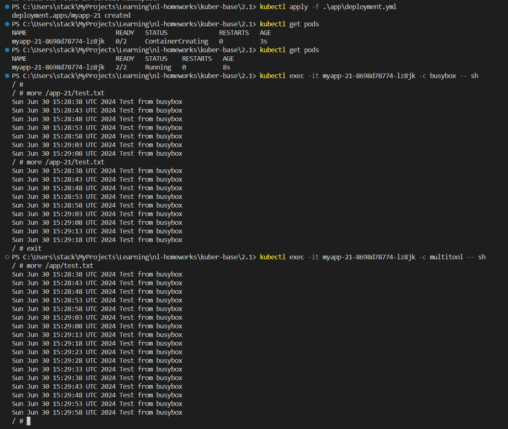
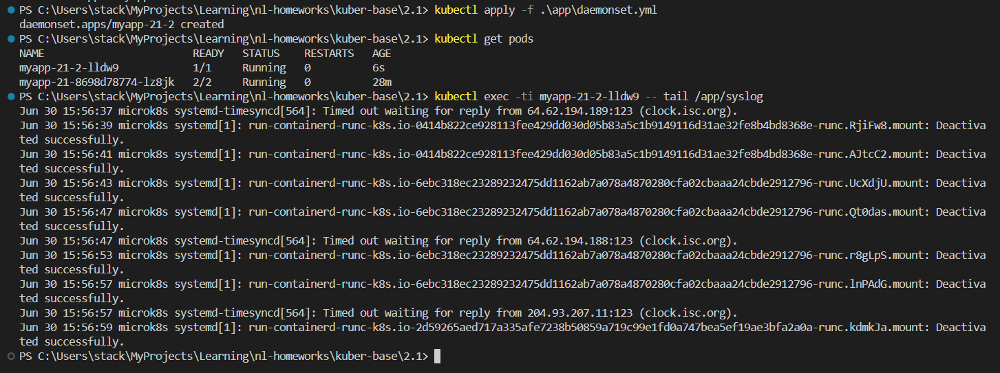

# Домашняя работа к занятию «Хранение в K8s. Часть 1»

## Цель задания

В тестовой среде Kubernetes нужно обеспечить обмен файлами между контейнерам пода и доступ к логам ноды.

------

### Дополнительные материалы для выполнения задания

1. [Инструкция по установке MicroK8S](https://microk8s.io/docs/getting-started).
2. [Описание Volumes](https://kubernetes.io/docs/concepts/storage/volumes/).
3. [Описание Multitool](https://github.com/wbitt/Network-MultiTool).

------

### Задание 1

**Что нужно сделать**

Создать Deployment приложения, состоящего из двух контейнеров и обменивающихся данными.

1. Создать Deployment приложения, состоящего из контейнеров busybox и multitool.
2. Сделать так, чтобы busybox писал каждые пять секунд в некий файл в общей директории.
3. Обеспечить возможность чтения файла контейнером multitool.
4. Продемонстрировать, что multitool может читать файл, который периодоически обновляется.
5. Предоставить манифесты Deployment в решении, а также скриншоты или вывод команды из п. 4.

------

### Ответ на задание 1

Создал файл [deployment.yml](./app/deployment.yml)

```bash
# очистка кластера от старых проектов
kubectl delete all --all
# разворачиваю приложения
kubectl apply -f .\app\deployment.yml
# проверка наличия подов
kubectl get pods
# просмотр файла в первом контейнере
kubectl exec -it myapp-21-8698d78774-lz8jk -c busybox -- sh
more /app-21/test.txt
exit
# просмотр файла во втором контейнере
kubectl exec -it myapp-21-8698d78774-lz8jk -c multitool -- sh
more /app/test.txt
exit
```



------

### Задание 2

**Что нужно сделать**

Создать DaemonSet приложения, которое может прочитать логи ноды.

1. Создать DaemonSet приложения, состоящего из multitool.
2. Обеспечить возможность чтения файла `/var/log/syslog` кластера MicroK8S.
3. Продемонстрировать возможность чтения файла изнутри пода.
4. Предоставить манифесты Deployment, а также скриншоты или вывод команды из п. 2.

------

### Ответ на задание 2

Создал файл [daemonset.yml](./app/daemonset.yml)

```bash
# разворачиваю приложения
kubectl apply -f .\app\daemonset.yml
# проверка наличия подов
kubectl get pods
# просмотр файла syslog хоста внутри пода
kubectl exec -ti myapp-21-2-lldw9 -- tail /app/syslog
```



------
