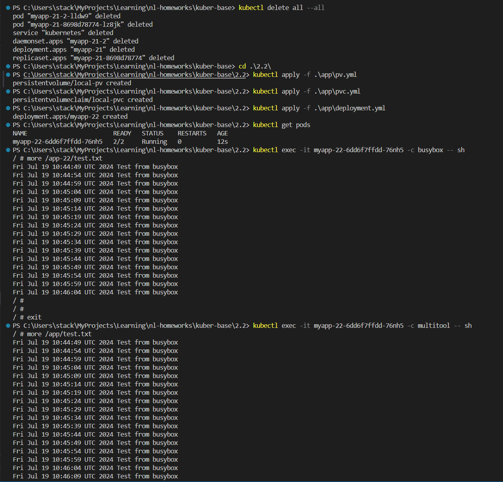
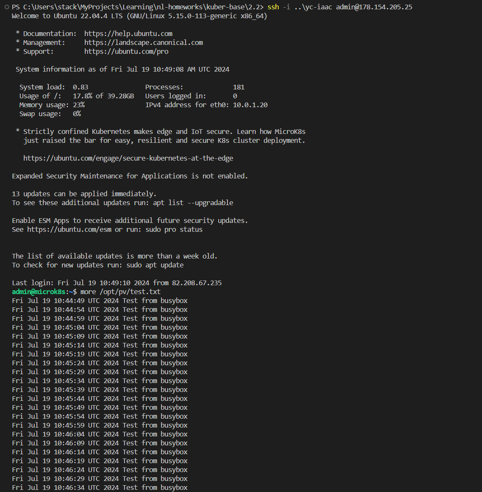
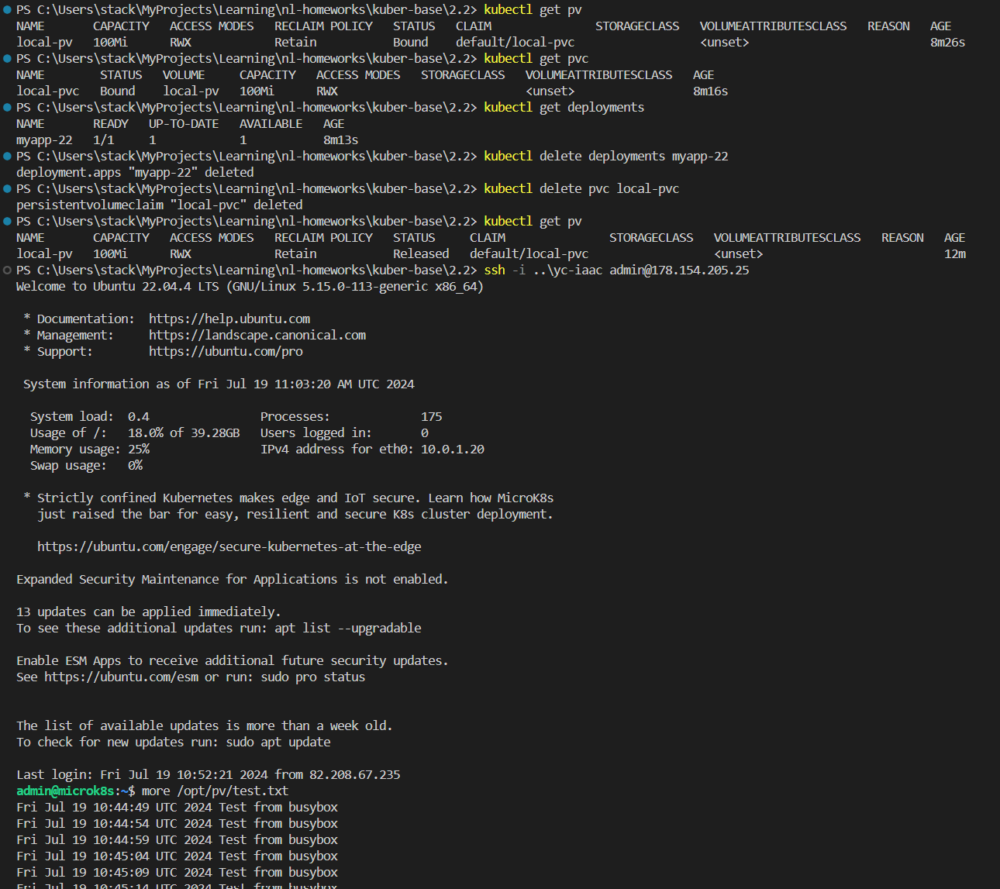
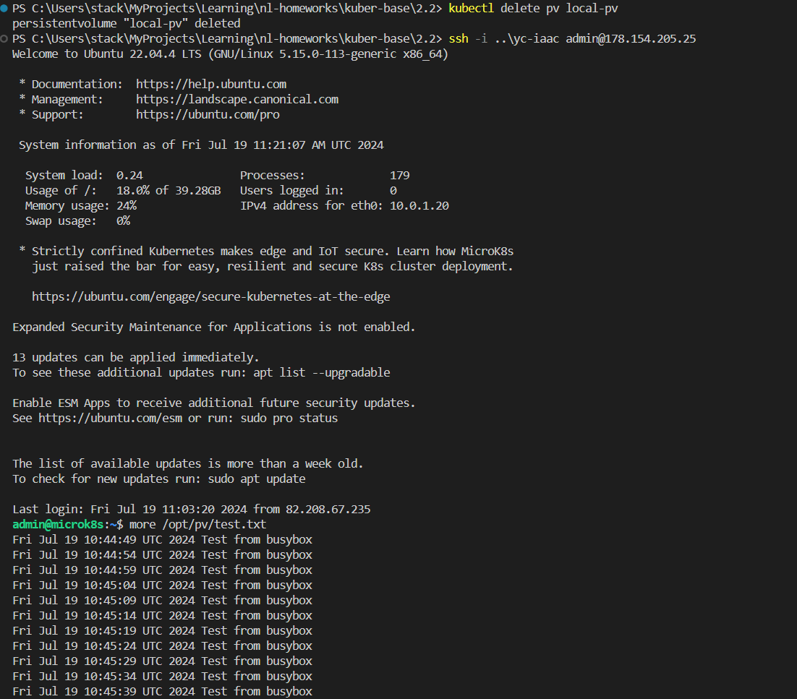
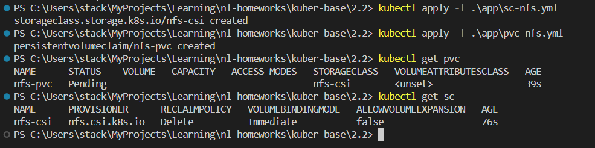
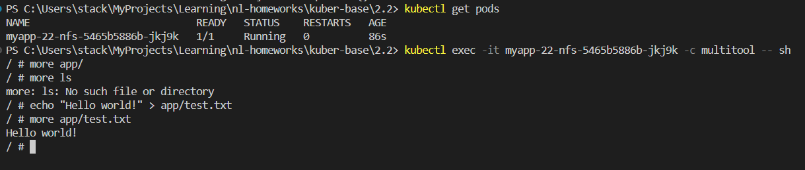
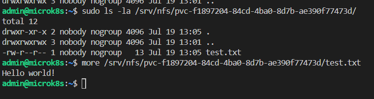

# Домашняя работа к занятию «Хранение в K8s. Часть 2»

## Цель задания

В тестовой среде Kubernetes нужно создать PV и продемострировать запись и хранение файлов.

------

## Дополнительные материалы для выполнения задания

1. [Инструкция по установке NFS в MicroK8S](https://microk8s.io/docs/nfs).
2. [Описание Persistent Volumes](https://kubernetes.io/docs/concepts/storage/persistent-volumes/).
3. [Описание динамического провижининга](https://kubernetes.io/docs/concepts/storage/dynamic-provisioning/).
4. [Описание Multitool](https://github.com/wbitt/Network-MultiTool).

------

### Задание 1

**Что нужно сделать**

Создать Deployment приложения, использующего локальный PV, созданный вручную.

1. Создать Deployment приложения, состоящего из контейнеров busybox и multitool.
2. Создать PV и PVC для подключения папки на локальной ноде, которая будет использована в поде.
3. Продемонстрировать, что multitool может читать файл, в который busybox пишет каждые пять секунд в общей директории.
4. Удалить Deployment и PVC. Продемонстрировать, что после этого произошло с PV. Пояснить, почему.
5. Продемонстрировать, что файл сохранился на локальном диске ноды. Удалить PV.  Продемонстрировать что произошло с файлом после удаления PV. Пояснить, почему.
6. Предоставить манифесты, а также скриншоты или вывод необходимых команд.

------

### Ответ на задание 1

Файл [deployment.yml](./app/deployment.yml)

Файл [pv.yml](./app/pv.yml)

Файл [pvc.yml](./app/pvc.yml)

```bash
# очистка кластера от старых проектов
kubectl delete all --all
# разворачиваю приложения
kubectl apply -f .\app\pv.yml
kubectl apply -f .\app\pvc.yml
kubectl apply -f .\app\deployment.yml
# проверка создания ресурсов
kubectl get pv
kubectl get pvc
kubectl get deployments
# проверка наличия подов
kubectl get pods
# просмотр файла в первом контейнере
kubectl exec -it myapp-22-6dd6f7ffdd-76nh5 -c busybox -- sh
more /app-22/test.txt
exit
# просмотр файла во втором контейнере
kubectl exec -it myapp-22-6dd6f7ffdd-76nh5 -c multitool -- sh
more /app/test.txt
exit
```



```bash
# просмотр файла на хранилище
ssh -i ..\yc-iaac admin@178.154.205.25
more /opt/pv/test.txt
```



```bash
# проверка статуса
kubectl get pv
kubectl get pvc
kubectl get deployments
# удаляем deployments и pvc
kubectl delete deployments myapp-22
kubectl delete pvc local-pvc
# смотрим снова статус pv
kubectl get pv
# просмотр файла на хранилище
ssh -i ..\yc-iaac admin@178.154.205.25
more /opt/pv/test.txt
```



После удаления deployment и pvc - pv перешёл из статуса Bound (связанного с подом) в Released (освобожденный - не связанный с подом) - данные остаются на месте, однако переиспользовать этот pv нельзя (только, при необходимости, можно удалить и создать с теми же именами заново, удалив при этом данные.) При удалении PV - данные так же остаются на месте и очищать их нужно вручную.



------

### Задание 2

**Что нужно сделать**

Создать Deployment приложения, которое может хранить файлы на NFS с динамическим созданием PV.

1. Включить и настроить NFS-сервер на MicroK8S.
2. Создать Deployment приложения состоящего из multitool, и подключить к нему PV, созданный автоматически на сервере NFS.
3. Продемонстрировать возможность чтения и записи файла изнутри пода.
4. Предоставить манифесты, а также скриншоты или вывод необходимых команд.

------

### Ответ на задание 2

Установка NFS сервера в кластере произведена по [иструкции](https://microk8s.io/docs/how-to-nfs)

```bash
# работы на сервере
ssh -i ..\yc-iaac admin@178.154.205.25

# устанавливаю и настраиваю NFS сервер
sudo apt-get install nfs-kernel-server

sudo mkdir -p /srv/nfs
sudo chown nobody:nogroup /srv/nfs
sudo chmod 0777 /srv/nfs

sudo mv /etc/exports /etc/exports.bak
echo '/srv/nfs 10.0.0.0/8(rw,sync,no_subtree_check)' | sudo tee /etc/exports

sudo systemctl restart nfs-kernel-server

# настраиваю microk8s для работы с NFS
microk8s enable helm3
microk8s helm3 repo add csi-driver-nfs https://raw.githubusercontent.com/kubernetes-csi/csi-driver-nfs/master/charts
microk8s helm3 repo update

microk8s helm3 install csi-driver-nfs csi-driver-nfs/csi-driver-nfs \
    --namespace kube-system \
    --set kubeletDir=/var/snap/microk8s/common/var/lib/kubelet

microk8s kubectl wait pod --selector app.kubernetes.io/name=csi-driver-nfs --for condition=ready --namespace kube-system
microk8s kubectl get csidrivers
# создаю SC и PVC
microk8s kubectl apply -f .\app\sc-nfs.yml
microk8s kubectl apply -f .\app\pvc-nfs.yml
# проверяю созданное
microk8s kubectl get pvc
microk8s kubectl get sc
```

[Storage Class для NFS](./app/sc-nfs.yml)

[Persistent Volume Claim для NFS](./app/pvc-nfs.yml)



Создал [deployment-nfs.yml](./app/deployment-nfs.yml)

```bash
# разворачиваю приложение
kubectl apply -f .\app\deployment-nfs.yml
kubectl get pods
# Создаю файл в поде и проверяю его
kubectl exec -it myapp-22-nfs-5465b5886b-jkj9k -c multitool -- sh
echo "Hello world!" > app/test.txt
more app/test.txt
```



Проверяю на сервере NFS


