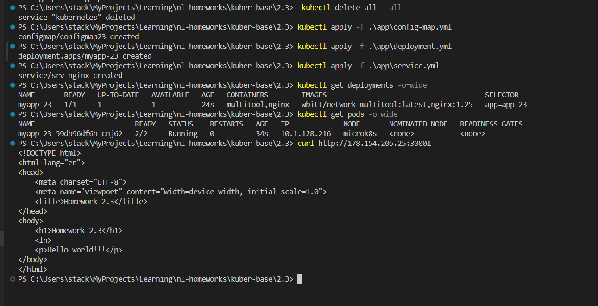
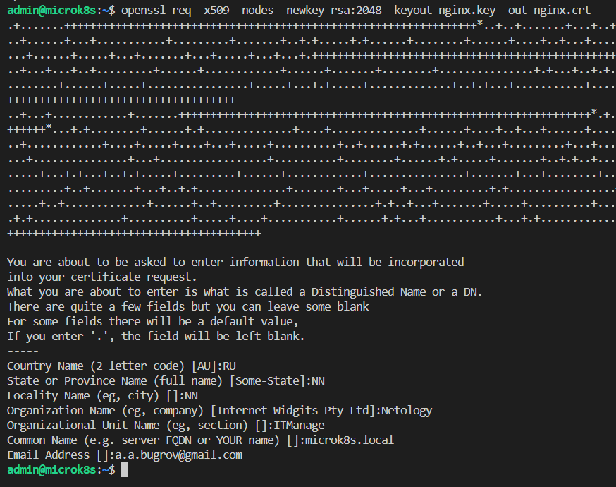
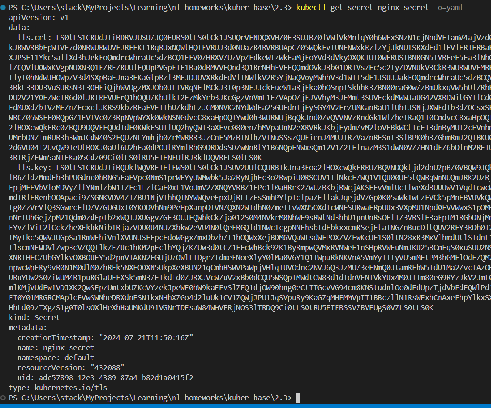
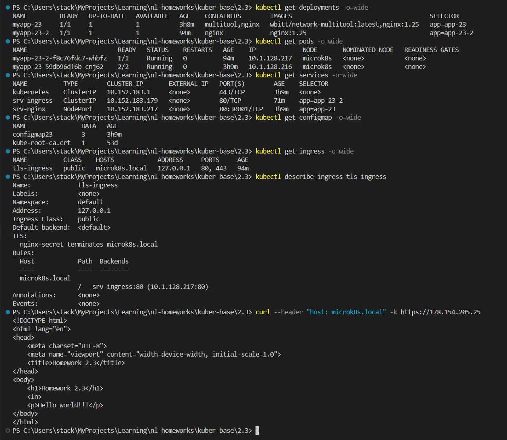

# Домашнее задание к занятию «Конфигурация приложений»

## Цель задания

В тестовой среде Kubernetes необходимо создать конфигурацию и продемонстрировать работу приложения.

------

### Чеклист готовности к домашнему заданию

1. Установленное K8s-решение (например, MicroK8s).
2. Установленный локальный kubectl.
3. Редактор YAML-файлов с подключённым GitHub-репозиторием.

------

### Инструменты и дополнительные материалы, которые пригодятся для выполнения задания

1. [Описание](https://kubernetes.io/docs/concepts/configuration/secret/) Secret.
2. [Описание](https://kubernetes.io/docs/concepts/configuration/configmap/) ConfigMap.
3. [Описание](https://github.com/wbitt/Network-MultiTool) Multitool.

------

### Задание 1. Создать Deployment приложения и решить возникшую проблему с помощью ConfigMap. Добавить веб-страницу

1. Создать Deployment приложения, состоящего из контейнеров nginx и multitool.
2. Решить возникшую проблему с помощью ConfigMap.
3. Продемонстрировать, что pod стартовал и оба конейнера работают.
4. Сделать простую веб-страницу и подключить её к Nginx с помощью ConfigMap. Подключить Service и показать вывод curl или в браузере.
5. Предоставить манифесты, а также скриншоты или вывод необходимых команд.

------

### Ответ на задание 1

Создал файлы

[deployment.yml](./app/deployment.yml)

[config-map.yml](./app/config-map.yml)

[service.yml](./app/service.yml)

```bash
# очистка кластера от старых проектов
kubectl delete all --all
# разворачиваю приложения
kubectl apply -f .\app\config-map.yml
kubectl apply -f .\app\deployment.yml
kubectl apply -f .\app\service.yml
# проверяю созданное
kubectl get deployments -o=wide
kubectl get pods -o=wide
# проверяю работоспособность 
curl http://178.154.205.25:30001
```



------

### Задание 2. Создать приложение с вашей веб-страницей, доступной по HTTPS

1. Создать Deployment приложения, состоящего из Nginx.
2. Создать собственную веб-страницу и подключить её как ConfigMap к приложению.
3. Выпустить самоподписной сертификат SSL. Создать Secret для использования сертификата.
4. Создать Ingress и необходимый Service, подключить к нему SSL в вид. Продемонстировать доступ к приложению по HTTPS.
5. Предоставить манифесты, а также скриншоты или вывод необходимых команд.

------

### Ответ на задание 2

Создал файлы

[nginx.yml](./app/nginx.yml)

[ingress-service.yml](./app/ingress-service.yml)

[ingress.yml](./app/ingress.yml)

Содержимое вэб страницы - подключаю ConfigMap из предыдущего задания.

```bash
# на сервере
# генерирую сертификат
openssl req -x509 -nodes -newkey rsa:2048 -keyout nginx.key -out nginx.crt
# создаю secret из этих сертификатов
microk8s kubectl create secret tls nginx-secret --cert=nginx.crt --key=nginx.key

# на удаленном клиенте
# разворачиваю приложение
kubectl apply -f .\app\nginx.yml
kubectl apply -f .\app\ingress.yml
kubectl apply -f .\app\ingress-service.yml

# проверяю конфигурацию
# просмотр конфигурации secret
kubectl get secret nginx-secret -o=yaml
# проверяю работоспособность приложения
kubectl get deployments -o=wide
kubectl get pods -o=wide
kubectl get services -o=wide
kubectl get configmap -o=wide
# проверяю ingress
kubectl get ingress -o=wide
kubectl describe ingress tls-ingress
# проверяю работоспособность
curl --header "host: microk8s.local" -k https://178.154.205.25

```






