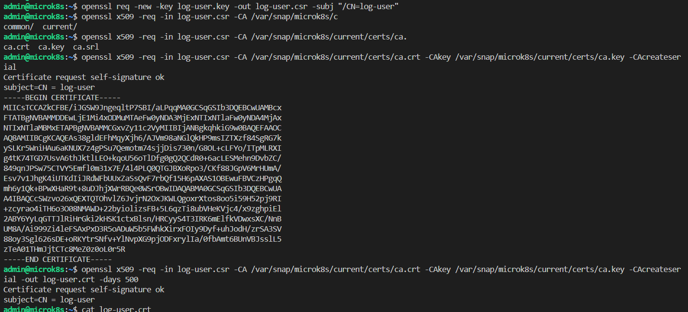
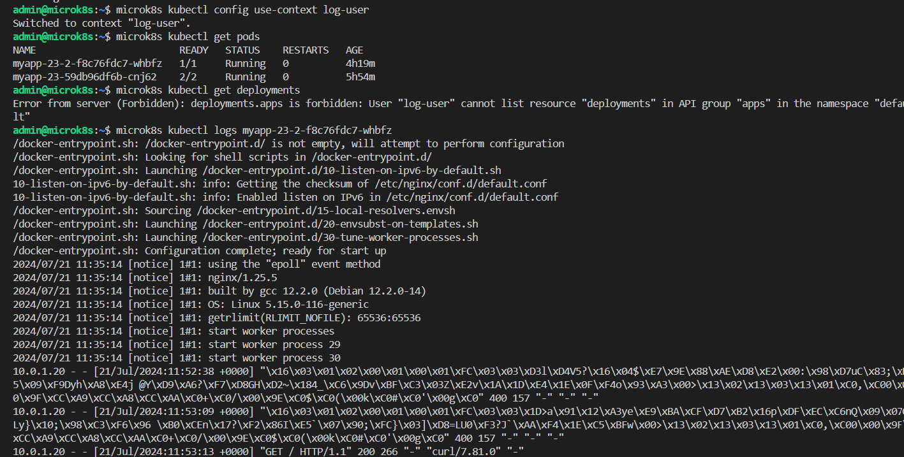

# Домашнее задание к занятию «Управление доступом»

## Цель задания

В тестовой среде Kubernetes нужно предоставить ограниченный доступ пользователю.

------

### Инструменты / дополнительные материалы, которые пригодятся для выполнения задания

1. [Описание](https://kubernetes.io/docs/reference/access-authn-authz/rbac/) RBAC.
2. [Пользователи и авторизация RBAC в Kubernetes](https://habr.com/ru/company/flant/blog/470503/).
3. [RBAC with Kubernetes in Minikube](https://medium.com/@HoussemDellai/rbac-with-kubernetes-in-minikube-4deed658ea7b).

------

### Задание 1. Создайте конфигурацию для подключения пользователя

1. Создайте и подпишите SSL-сертификат для подключения к кластеру.
2. Настройте конфигурационный файл kubectl для подключения.
3. Создайте роли и все необходимые настройки для пользователя.
4. Предусмотрите права пользователя. Пользователь может просматривать логи подов и их конфигурацию (`kubectl logs pod <pod_id>`, `kubectl describe pod <pod_id>`).
5. Предоставьте манифесты и скриншоты и/или вывод необходимых команд.

------

### Ответ на задание 1

```bash
# работы на сервере
# включаю функционал rbac
microk8s enable rbac
# генерирую ключ
openssl genrsa -out log-user.key 2048
openssl req -new -key log-user.key -out log-user.csr -subj "/CN=log-user"
# подписываю ключ пользователя сертификатом сервера kubernetes
openssl x509 -req -in log-user.csr -CA /var/snap/microk8s/current/certs/ca.crt -CAkey /var/snap/microk8s/current/certs/ca.key -CAcreateserial -out log-user.crt -days 500
# добавляю пользователя в конфиг
microk8s kubectl config set-credentials log-user --client-certificate=log-user.crt --client-key=log-user.key --embed-certs=true
# создаю контекст для пользователя
microk8s kubectl config set-context log-user --cluster=microk8s-cluster --user=log-user
# можно переключить контекст
microk8s kubectl config use-context log-user

# настраиваю права пользователю с клиентской машины.
# можно сделать и на сервере - переключив контекст назад
kubectl apply -f .\app\role.yml
kubectl apply -f .\app\role-binding.yml

# далее на сервере проверяю работоспособность
# можно и на клиенте - обновив конфиг подключения к кластеру и переключив контекст
## скопировать новый конфиг на клиента
## microk8s config > new-yc-nl-microk8s
microk8s kubectl get pods
microk8s kubectl get deployments
microk8s kubectl logs myapp-23-2-f8c76fdc7-whbfz
microk8s kubectl describe pod
```




