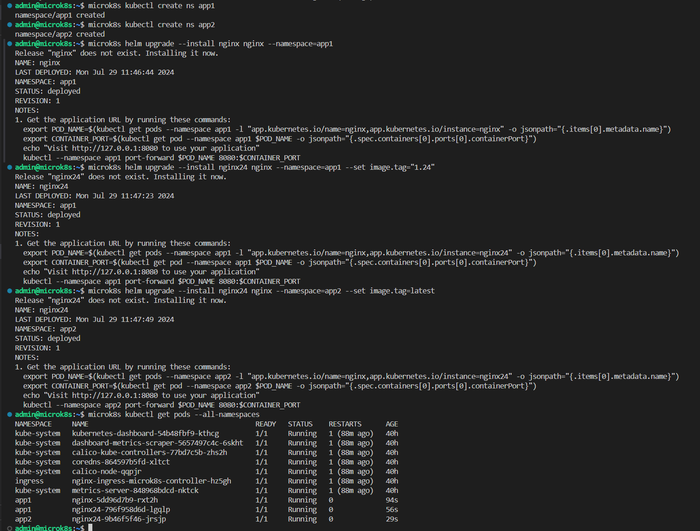

# Домашняя работа к занятию «Helm»

## Цель задания

В тестовой среде Kubernetes необходимо установить и обновить приложения с помощью Helm.

------

### Инструменты и дополнительные материалы, которые пригодятся для выполнения задания

1. [Инструкция](https://helm.sh/docs/intro/install/) по установке Helm. [Helm completion](https://helm.sh/docs/helm/helm_completion/).

------

## Задание 1. Подготовить Helm-чарт для приложения

1. Необходимо упаковать приложение в чарт для деплоя в разные окружения.
2. Каждый компонент приложения деплоится отдельным deployment’ом или statefulset’ом.
3. В переменных чарта измените образ приложения для изменения версии.

------

### Ответ на задание 1

```bash
# создаем чарт
microk8s helm create nginx

# меняем переменную в Chart.yaml 
# appVersion: "1.25"

# меняем переменные в value.yaml 
# image.repository: nginx
# image.tag: "1.25"

```

Файл [Chart.yaml](./app/nginx/Chart.yaml)

Файл [values.yaml](./app/nginx/values.yaml)

------

## Задание 2. Запустить две версии в разных неймспейсах

1. Подготовив чарт, необходимо его проверить. Запуститe несколько копий приложения.
2. Одну версию в namespace=app1, вторую версию в том же неймспейсе, третью версию в namespace=app2.
3. Продемонстрируйте результат.

------

### Ответ на задание 2

```bash
# проверка линтером
microk8s helm lint nginx

# создаю немспейсы app1 app2
microk8s kubectl create ns app1
microk8s kubectl create ns app2

# запускаю приложения
microk8s helm upgrade --install nginx nginx --namespace=app1
microk8s helm upgrade --install nginx24 nginx --namespace=app1 --set image.tag="1.24"
microk8s helm upgrade --install nginx24 nginx --namespace=app2 --set image.tag=latest

# смотрю результат
microk8s kubectl get pods --all-namespaces
```


