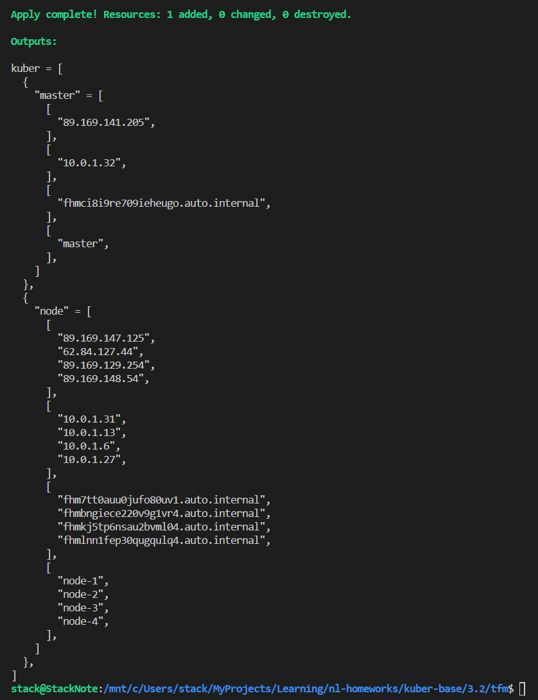
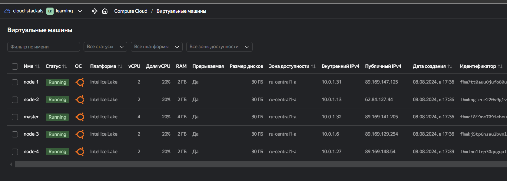
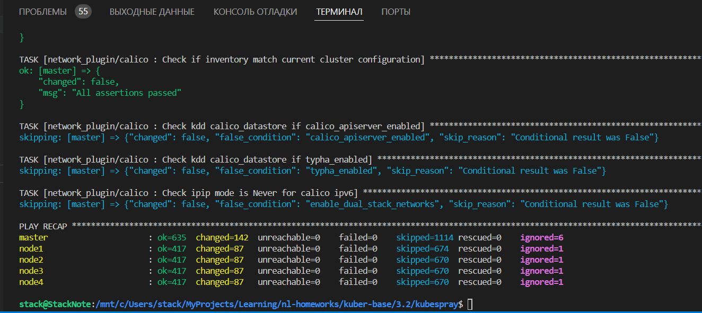
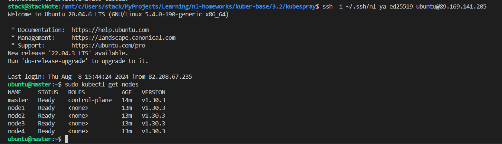

# Домашняя работа к занятию «Установка Kubernetes»

## Цель задания

Установить кластер K8s.

### Чеклист готовности к домашнему заданию

1. Развёрнутые ВМ с ОС Ubuntu 20.04-lts.

### Инструменты и дополнительные материалы, которые пригодятся для выполнения задания

1. [Инструкция по установке kubeadm](https://kubernetes.io/docs/setup/production-environment/tools/kubeadm/create-cluster-kubeadm/).
2. [Документация kubespray](https://kubespray.io/).

-----

## Задание 1. Установить кластер k8s с 1 master node

1. Подготовка работы кластера из 5 нод: 1 мастер и 4 рабочие ноды.
2. В качестве CRI — containerd.
3. Запуск etcd производить на мастере.
4. Способ установки выбрать самостоятельно.

-----

### Ответ на задание 1

Создаю конфигурацию для [terraform](./tfm/)

После создания - получаю готовые машины с внешними IP.

```bash
cd nl-homeworks/kuber-base/3.2/tfm

# применяю terraform
terraform init
terraform validate
terraform fmt
terraform plan
terraform apply -auto-approve
```





Теперь устанавливаю кластер kubernetes с помощью ansible.

Заполняю файл [inventory.ini](./inventory.ini) IP адресами хостов. Так же проверяю переменные для inventory kubespray - необходимо удостовериться, что используется указанный в задании containerd.

```bash
# kubespray\inventory\my_cluster\group_vars\k8s_cluster\k8s-cluster.yml

## Container runtime
## docker for docker, crio for cri-o and containerd for containerd.
## Default: containerd
container_manager: containerd
```

```bash
# установка python 3.12
sudo apt update && sudo apt upgrade -y
sudo apt install software-properties-common -y
sudo add-apt-repository ppa:deadsnakes/ppa
sudo apt update
sudo apt install python3.12 python3.12-venv

# настройка kubespray
git clone https://github.com/kubernetes-sigs/kubespray
cd kubespray
python3.12 -m venv .venv
.venv/bin/pip install --upgrade pip
.venv/bin/pip install -r requirements.txt

# правлю inventory.ini
cp inventory/samples inventory/my_cluster
nano inventory/inventory.ini

# запускаю playbook
.venv/bin/ansible-playbook -u ubuntu --private-key ~/.ssh/nl-ya-ed25519 -i inventory/my_cluster/inventory.ini cluster.yml -b -v

# проверяю кластер kubernetes
ssh -i ~/.ssh/nl-ya-ed25519 ubuntu@89.169.141.205
sudo kubectl get nodes
```





## Дополнительные задания (со звёздочкой)

**Настоятельно рекомендуем выполнять все задания под звёздочкой.** Их выполнение поможет глубже разобраться в материале.
Задания под звёздочкой необязательные к выполнению и не повлияют на получение зачёта по этому домашнему заданию.

-----

## Задание 2*. Установить HA кластер

1. Установить кластер в режиме HA.
2. Использовать нечётное количество Master-node.
3. Для cluster ip использовать keepalived или другой способ.

-----

### Ответ на задание 2

К сожалению, времени не хватает решить. Но в целом это делается так же. Только количество master нод должно быть не менее 3 штук. Так же для большей устойчивости кластера мастера и ноды имеет смысл разнести по разным зонам доступности.

-----

### Правила приёма работы

1. Домашняя работа оформляется в своем Git-репозитории в файле README.md. Выполненное домашнее задание пришлите ссылкой на .md-файл в вашем репозитории.
2. Файл README.md должен содержать скриншоты вывода необходимых команд `kubectl get nodes`, а также скриншоты результатов.
3. Репозиторий должен содержать тексты манифестов или ссылки на них в файле README.md.
