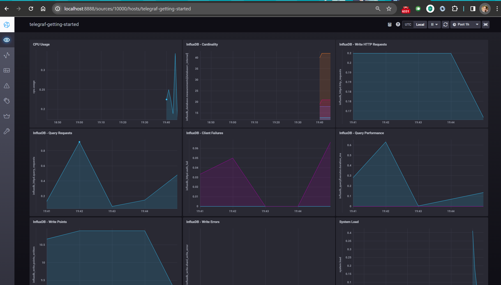
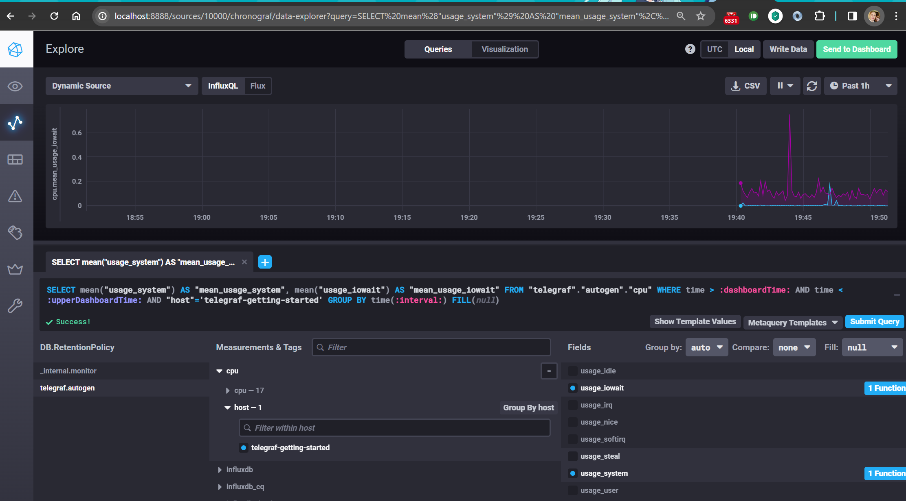
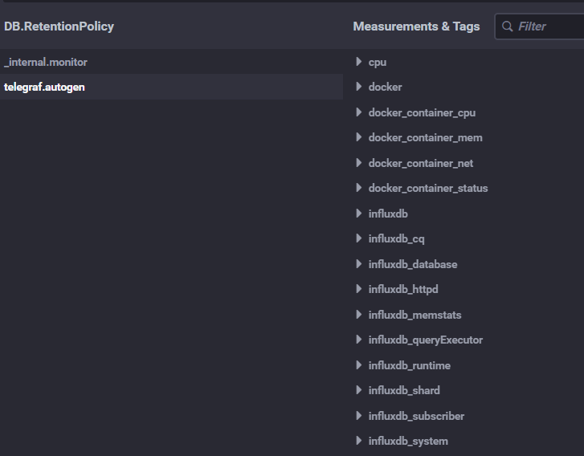

# Домашняя работа к занятию 13 «Введение в мониторинг»

## Обязательные задания

1. Вас пригласили настроить мониторинг на проект. На онбординге вам рассказали, что проект представляет из себя
платформу для вычислений с выдачей текстовых отчетов, которые сохраняются на диск. Взаимодействие с платформой
осуществляется по протоколу http. Также вам отметили, что вычисления загружают ЦПУ. Какой минимальный набор метрик вы
выведите в мониторинг и почему?

### Ответ

- Мониторинг свободного места на диске и свободных inode - отчёты могут заполнить диск.
- Мониторинг ввода/вывода на диск (iops) - если отчётов много и они одновременно будут писаться на диск - это может быть узким местом.
- Мониторинг ответов http сервера - 4хх и 5хх ошибки - указывают на проблемы на сервере, а общее количество запросов за момент времени - позволяет следить за нагрузкой на него.
- Мониторинг нагрузки на CPU - непосредственно позволяет следить за вычислительной нагрузкой на сервер.

2. Менеджер продукта посмотрев на ваши метрики сказал, что ему непонятно что такое RAM/inodes/CPUla. Также он сказал,
что хочет понимать, насколько мы выполняем свои обязанности перед клиентами и какое качество обслуживания. Что вы
можете ему предложить?

### Ответ

- Переименовать метрики в понятные менеджеру понятия
- Договориться с клиентом обуровне обслуживания и соответственно отобразить их в метриках. Настроить триггеры нарушения этих условий.

3. Вашей DevOps команде в этом году не выделили финансирование на построение системы сбора логов. Разработчики в свою
очередь хотят видеть все ошибки, которые выдают их приложения. Какое решение вы можете предпринять в этой ситуации,
чтобы разработчики получали ошибки приложения?

### Ответ

- Перенаправить логи от приложений на доступный ресурс для разработчиков (на чтение)
- Так же можно настроить syslog на отправку необходимых логов на системы разработчиков

4. Вы, как опытный SRE, сделали мониторинг, куда вывели отображения выполнения SLA=99% по http кодам ответов.
Вычисляете этот параметр по следующей формуле: summ_2xx_requests/summ_all_requests. Данный параметр не поднимается выше
70%, но при этом в вашей системе нет кодов ответа 5xx и 4xx. Где у вас ошибка?

### Ответ

- Нужно учитывать что есть коды 1хх - информационные и 3хх - перенаправления. Их суммировать с 2хх.

5. Опишите основные плюсы и минусы pull и push систем мониторинга.

### Ответ

- push - клиенты (агенты на них) сами отдают данные. Могут отдавать сразу в несколько систем. Можно гибко настроить частоту и объем передаваемых данных. Из минусов - настройка непосредственно агента на клиенте (особенно если их много)
- pull - клиента опрашивает сервер и агент возвращает ему данные. Проще настроить - непосредственно с сервера. Более безопасное подключение - сервер знает кого опрашивать, а кого не надо.

6. Какие из ниже перечисленных систем относятся к push модели, а какие к pull? А может есть гибридные?

    - Prometheus
    - TICK
    - Zabbix
    - VictoriaMetrics
    - Nagios

### Ответ

- Prometheus PULL : одновременно опрашивает системы, так же может получать данные от агентов exporter-ов, и получать метрики о событиях
- TICK - push/telegraph , pull/kapacitor
- Zabbix - push/pull
- VictoriaMetrics - push
- Nagios - pull

7. Склонируйте себе [репозиторий](https://github.com/influxdata/sandbox/tree/master) и запустите TICK-стэк,
используя технологии docker и docker-compose.

### Ответ

Для запуска в WSL поправлены `docker-compose.yml` и `sandbox` - [код здесь](./sandbox/)

```bash
# запуск осуществляется исправленным скриптом из кодовой базы sandbox
./sandbox up
```



8. Перейдите в веб-интерфейс Chronograf (<http://localhost:8888>) и откройте вкладку Data explorer.

### Ответ



9. Изучите список [telegraf inputs](https://github.com/influxdata/telegraf/tree/master/plugins/inputs).
Добавьте в конфигурацию telegraf следующий плагин - [docker](https://github.com/influxdata/telegraf/tree/master/plugins/inputs/docker):

### Ответ

Для корректной работы плагина docker в wsl необходимо поправить путь до docker.sock

```bash
  telegraf:
    volumes:
      - /mnt/wsl/docker-desktop/shared-sockets/guest-services/docker.sock:/var/run/docker.sock
```


