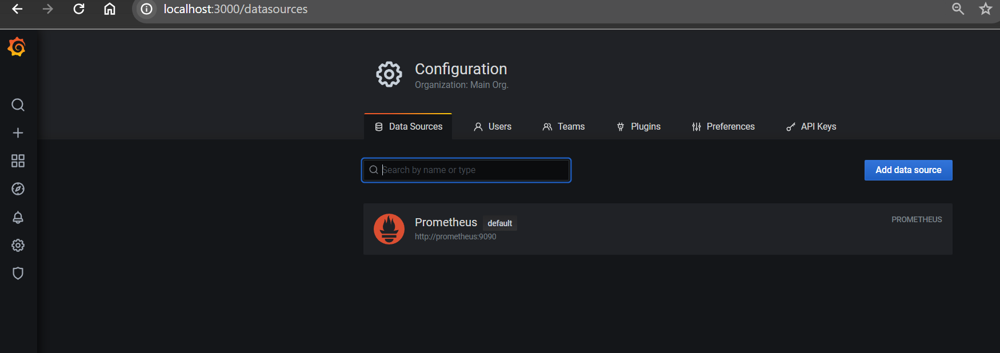
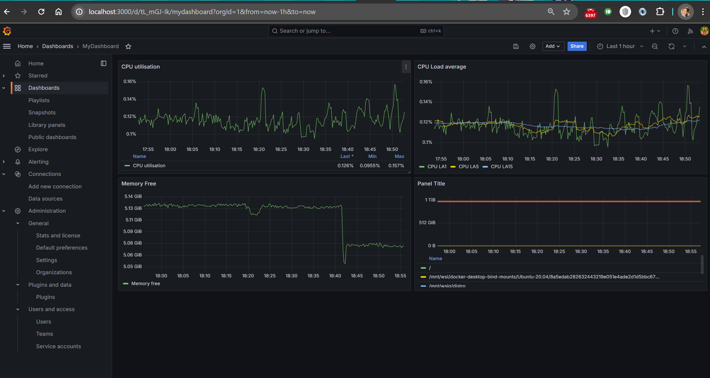
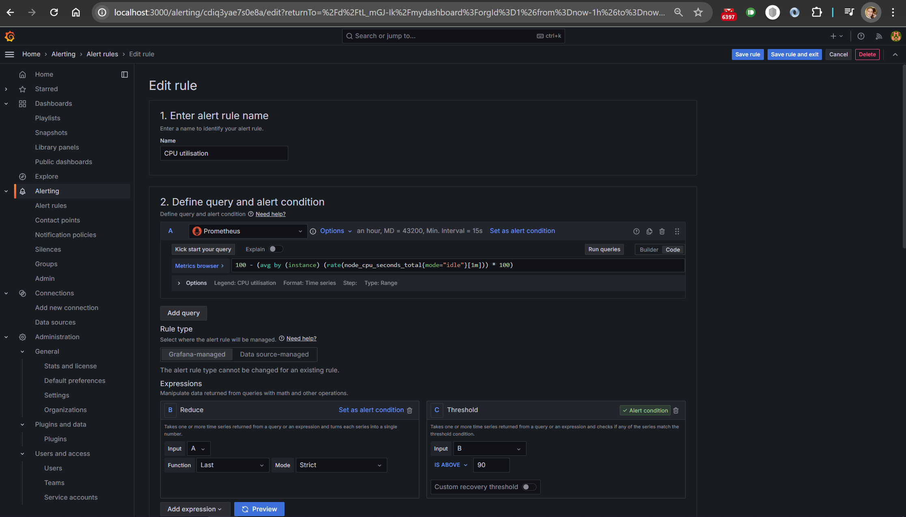

# Домашняя работа к занятию 14 «Средство визуализации Grafana»

### Задание 1

Используя [docker-compose.yml](./app/docker-compose.yml) развернут prometeus и grafana.
Grafana установлена последней версии - в указанной в задании наблюдались проблемы при вводе метрик в запрос.



## Задание 2

Изучены самостоятельно ресурсы:

1. [Understanding Machine CPU usage](https://www.robustperception.io/understanding-machine-cpu-usage).
2. [Introduction to PromQL, the Prometheus query language](https://grafana.com/blog/2020/02/04/introduction-to-promql-the-prometheus-query-language/).

Создан Dashboard и в ней Panels:

- утилизация CPU для nodeexporter (в процентах, 100-idle);

```bash
100 - (avg by (instance) (rate(node_cpu_seconds_total{mode="idle"}[1m])) * 100)
```

- CPULA 1/5/15;

```bash
100 - (avg by (instance) (rate(node_cpu_seconds_total{mode="idle"}[1m])) * 100)
100 - (avg by (instance) (rate(node_cpu_seconds_total{mode="idle"}[5m])) * 100)
100 - (avg by (instance) (rate(node_cpu_seconds_total{mode="idle"}[15m])) * 100)
```

- количество свободной оперативной памяти;

```bash
node_memory_MemFree_bytes{}
```

- количество места на файловой системе.

```bash
node_filesystem_free_bytes{fstype="ext4"}
```



## Задание 3

Созданы алерты



## Задание 4

Файл JSON получившегося Dashboard

[Dashboard.json](./Dashboard.json)
