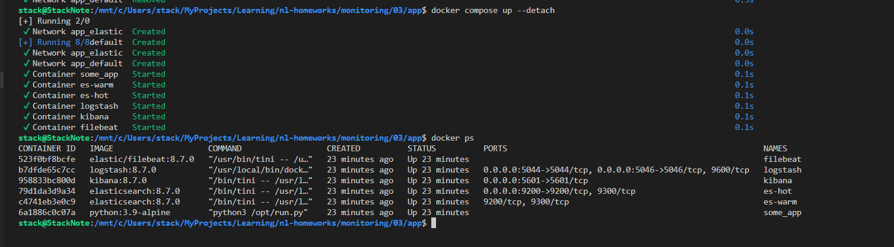
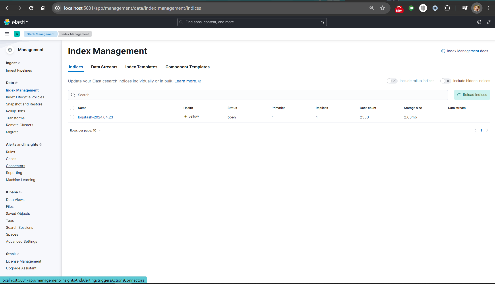
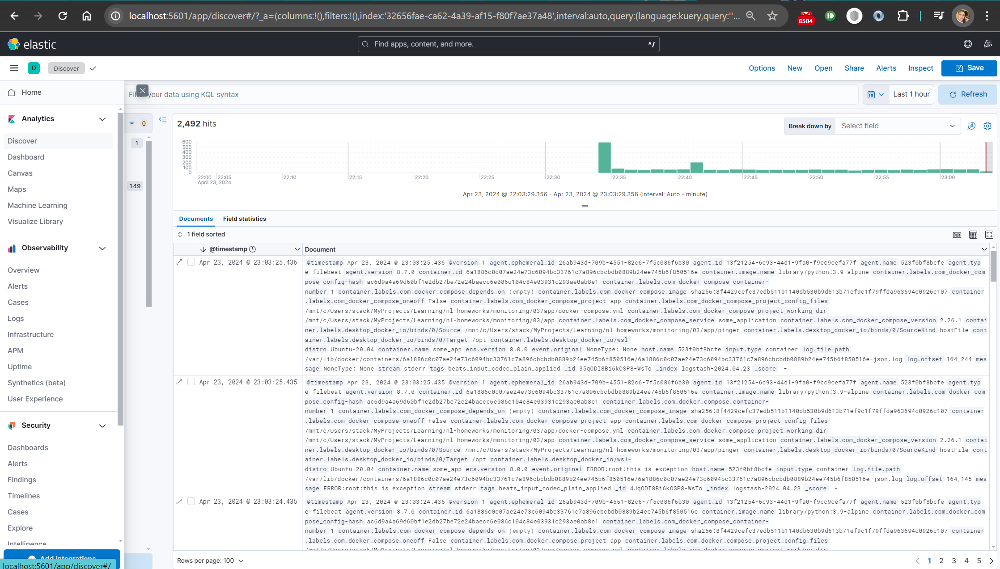
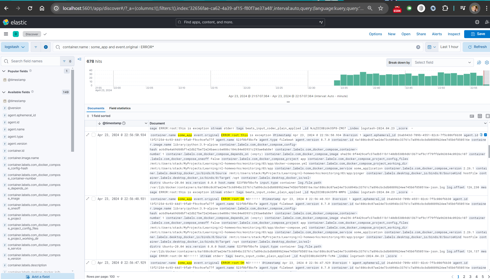

# Домашняя работа к занятию 15 «Система сбора логов Elastic Stack»

Дополнительная подготовка для WSL

```bash
# В windows:
net use w: \\wsl$\Ubuntu
# В WSL2
sudo mkdir /mnt/w
sudo mount -t drvfs w: /mnt/w
ls /mnt/w
```

И меняем точки монтирования для сервиса [filebit](./app/docker-compose.yml)

## Задание 1





## Задание 2


