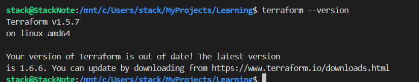
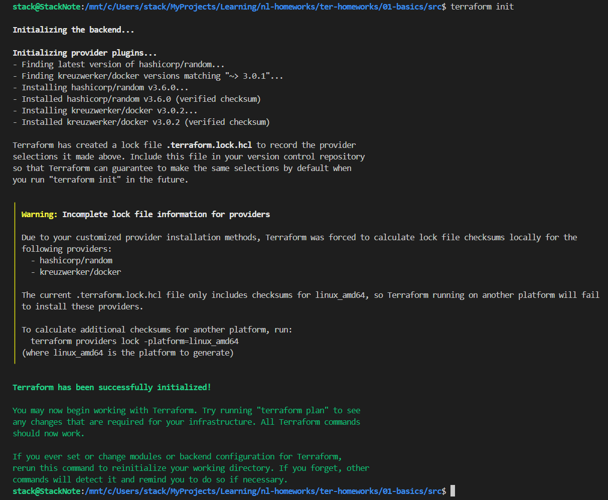
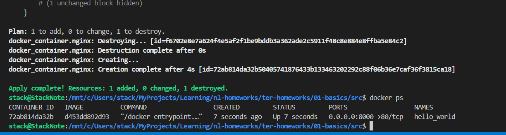
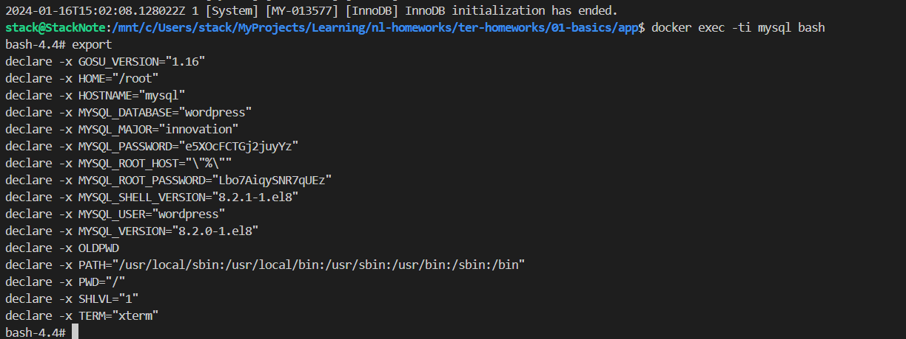

# Домашняя работа к занятию «Введение в Terraform»

## Чек-лист готовности к домашнему заданию

```bash
    docker run --rm --name terraform --entrypoint "/bin/sh" -v ~/.local/bin:/app hashicorp/terraform:1.5.7 -c "cp /bin/terraform /app"

    terraform --version
    Terraform v1.5.7
    on linux_amd64

    Your version of Terraform is out of date! The latest version
    is 1.6.6. You can update by downloading from https://www.terraform.io/downloads.html

    nano ~/.terraformrc

    provider_installation {
    network_mirror {
        url = "https://registry.comcloud.xyz/"
    }
    }
```



## Задание 1

1. Перейдите в каталог [**src**](https://github.com/netology-code/ter-homeworks/tree/main/01/src). Скачайте все необходимые зависимости, использованные в проекте.

    ```bash
        cd src
        terraform init
    ```

    

2. Изучите файл **.gitignore**. В каком terraform-файле, согласно этому .gitignore, допустимо сохранить личную, секретную информацию?

    ```bash
        # own secret vars store.
        personal.auto.tfvars
    ```

3. Выполните код проекта. Найдите  в state-файле секретное содержимое созданного ресурса **random_password**, пришлите в качестве ответа конкретный ключ и его значение.

    ```bash
        terraform apply
    ```

    "result": "qAqHQlS6DDr8x3M2",

4. Раскомментируйте блок кода, примерно расположенный на строчках 29–42 файла **main.tf**.
Выполните команду ```terraform validate```. Объясните, в чём заключаются намеренно допущенные ошибки. Исправьте их.

    ```bash
    terraform validate
    ╷
    │ Error: Invalid resource name
    │
    │   on main.tf line 29, in resource "docker_container" "1nginx":
    │   29: resource "docker_container" "1nginx" {
    │
    │ A name must start with a letter or underscore and may contain only letters, digits, underscores, and dashes.
    ```

    Имя ресурса должно начинаться с буквы или подчёркивания. Необходимо переименовать ресурс "1nginx" например в "nginx".

    ```bash
    terraform validate
    ╷
    │ Error: Reference to undeclared resource
    │
    │   on main.tf line 30, in resource "docker_container" "nginx":
    │   30:   image = docker_image.nginx.image_id
    │
    │ A managed resource "docker_image" "nginx" has not been declared in the root module.
    ╵
    ╷
    │ Error: Reference to undeclared resource
    │
    │   on main.tf line 31, in resource "docker_container" "nginx":
    │   31:   name  = "example_${random_password.random_string_FAKE.resulT}"
    │
    │ A managed resource "random_password" "random_string_FAKE" has not been declared in the root module.
    ```

    Теперь необходим ресурс "docker_container" "nginx" - необходимо раскомментировать строки 24-27 и исправить имя ресурса на resource "docker_image" "nginx" , т.к. используется ``image = docker_image.nginx.image_id``
    Так же необходимо исправить 31 строку на ``name  = "example_${random_password.random_string.result}"`` , так как мы создавали ресурс "random_password" "random_string" имеющий поле "result"

5. Выполните код. В качестве ответа приложите: исправленный фрагмент кода и вывод команды ```docker ps```.

    ```bash
        resource "docker_image" "nginx" {
        name         = "nginx:latest"
        keep_locally = true
        }

        resource "docker_container" "nginx" {
        image = docker_image.nginx.image_id
        name  = "example_${random_password.random_string.result}"

        ports {
            internal = 80
            external = 8000
        }
        }

        docker ps 
        CONTAINER ID   IMAGE          COMMAND                  CREATED          STATUS          PORTS                  NAMES
        9c4bfce01675   d453dd892d93   "/docker-entrypoint.…"   39 seconds ago   Up 38 seconds   0.0.0.0:8000->80/tcp   example_qAqHQlS6DDr8x3M2
    ```

6. Замените имя docker-контейнера в блоке кода на ```hello_world```. Не перепутайте имя контейнера и имя образа. Мы всё ещё продолжаем использовать name = "nginx:latest". Выполните команду ```terraform apply -auto-approve```.
Объясните своими словами, в чём может быть опасность применения ключа  ```-auto-approve```. Догадайтесь или нагуглите зачем может пригодиться данный ключ? В качестве ответа дополнительно приложите вывод команды ```docker ps```.

    ```bash
        resource "docker_container" "nginx" {
        image = docker_image.nginx.image_id
        # name  = "example_${random_password.random_string.result}"
        name = "hello_world"

        ports {
            internal = 80
            external = 8000
        }
        }

        terraform apply -auto-approve
        docker ps
        CONTAINER ID   IMAGE          COMMAND                  CREATED         STATUS         PORTS                  NAMES
        72ab814da32b   d453dd892d93   "/docker-entrypoint.…"   7 seconds ago   Up 7 seconds   0.0.0.0:8000->80/tcp   hello_world
    ```

    

    Опасность применения ключа ``-auto-approve`` в том что если план не отлажен - можно получить результат отличный от ожидаемого. Данный ключ необходим в пайплайнах CI/CD.

8. Уничтожьте созданные ресурсы с помощью **terraform**. Убедитесь, что все ресурсы удалены. Приложите содержимое файла **terraform.tfstate**.

    ```bash
        terraform destroy

        cat terraform.tfstate
        {
        "version": 4,
        "terraform_version": "1.5.7",
        "serial": 17,
        "lineage": "7b555414-aa0a-c6c7-61c8-7b3b5351a915",
        "outputs": {},
        "resources": [],
        "check_results": null
        }
    ```

9. Объясните, почему при этом не был удалён docker-образ **nginx:latest**. Ответ **обязательно** подкрепите строчкой из документации [**terraform провайдера docker**](https://docs.comcloud.xyz/providers/kreuzwerker/docker/latest/docs).  (ищите в классификаторе resource docker_image )

    Потому что в параметрах ресурса выставлено ``keep_locally = true``, это значит что при выполнении destroy образ не будет удаляться.
    ``keep_locally (Boolean) If true, then the Docker image won't be deleted on destroy operation. If this is false, it will delete the image from the docker local storage on destroy operation.``

------

## Дополнительное задание (со звёздочкой*)

### Задание 2*

1. Создайте в облаке ВМ. Сделайте это через web-консоль, чтобы не слить по незнанию токен от облака в github(это тема следующей лекции). Если хотите - попробуйте сделать это через terraform, прочита документацию yandex cloud. Используйте файл ```personal.auto.tfvars``` и гитигнор или иной, безопасный способ передачи токена!

    Машина создана через web-консоль.

2. Подключитесь к ВМ по ssh и установите стек docker.

    ```bash
        # Add Docker's official GPG key:
        sudo apt-get update
        sudo apt-get install ca-certificates curl gnupg
        sudo install -m 0755 -d /etc/apt/keyrings
        curl -fsSL https://download.docker.com/linux/debian/gpg | sudo gpg --dearmor -o /etc/apt/keyrings/docker.gpg
        sudo chmod a+r /etc/apt/keyrings/docker.gpg

        # Add the repository to Apt sources:
        echo \
        "deb [arch=$(dpkg --print-architecture) signed-by=/etc/apt/keyrings/docker.gpg] https://download.docker.com/linux/debian \
        $(. /etc/os-release && echo "$VERSION_CODENAME") stable" | \
        sudo tee /etc/apt/sources.list.d/docker.list > /dev/null
        sudo apt-get update
    ```

3. Найдите в документации docker provider способ настроить подключение terraform на вашей рабочей станции к remote docker context вашей ВМ через ssh.

    ```bash
        # На удаленной машине
        sudo systemctl edit docker.service

        [Service]
        ExecStart=
        ExecStart=/usr/bin/dockerd -H fd:// -H tcp://0.0.0.0:2375

        sudo systemctl daemon-reload
        sudo systemctl restart docker.service

        docker context create --docker host=tcp://0.0.0.0:2375 ya
        docker context use ya

        # На машине с terraform добавить провайдер ( указать IP адрес удаленной машины )
        provider "docker" {
        host = "tcp://158.160.66.165:2375"
        }
    ```

4. Используя terraform и remote docker context, скачайте и запустите на вашей ВМ контейнер ```mysql:8``` на порту ```127.0.0.1:3306```, передайте ENV-переменные. Сгенерируйте разные пароли через random_password и передайте их в контейнер, используя интерполяцию из примера с nginx.(```name  = "example_${random_password.random_string.result}"```  , двойные кавычки и фигурные скобки обязательны!)

    [итоговый main.tf](./app/main.tf)

6. Зайдите на вашу ВМ , подключитесь к контейнеру и проверьте наличие секретных env-переменных с помощью команды ```env```. Запишите ваш финальный код в репозиторий.

    ```bash
        # Подключимся через context
        docker context create --docker host=tcp://0.0.0.0:2375 ya
        docker context use ya

        docker exec -ti mysql bash
    ```

    
