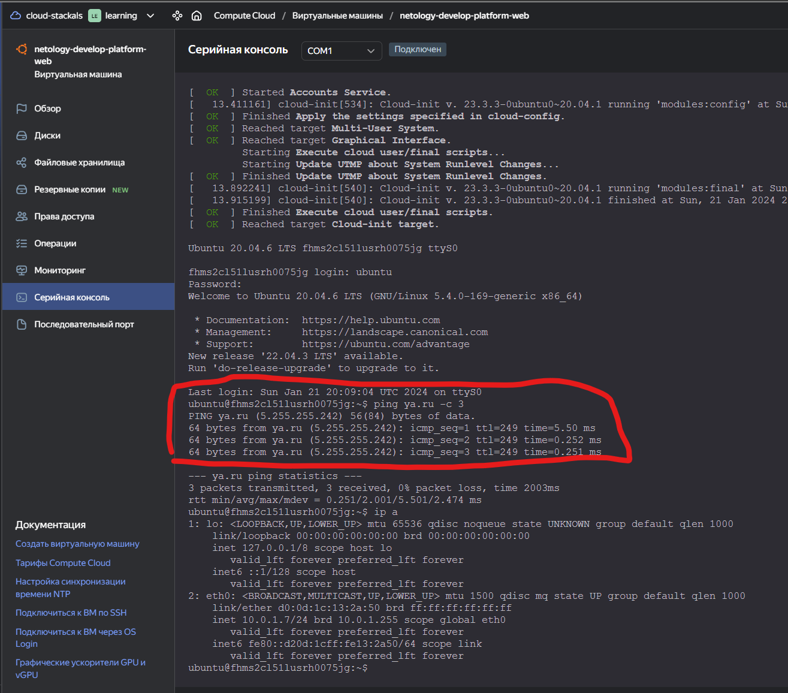
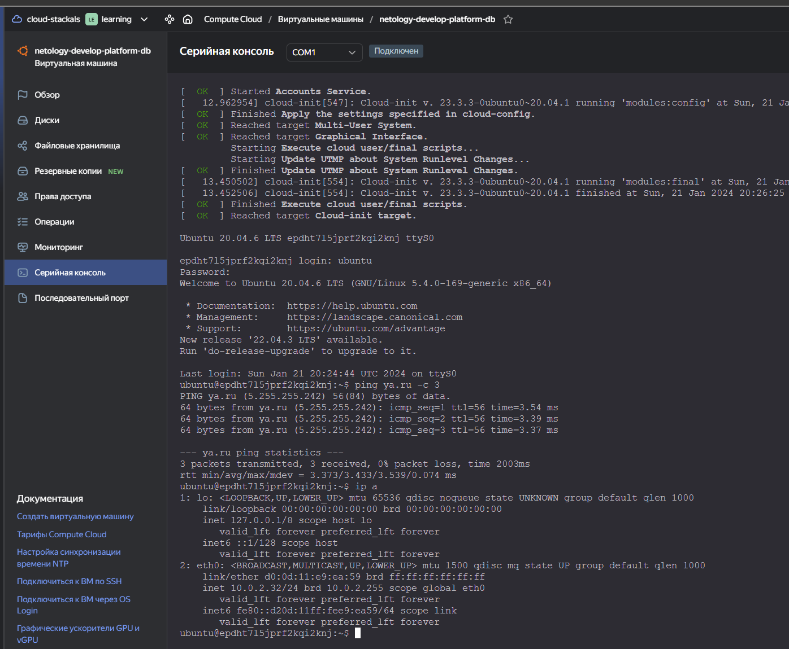

# Домашняя работа к занятию «Основы Terraform. Yandex Cloud»

## Задание 1

  ```bash
  #Add to personal.auto.tfvars
  token = "y0_key"
  cloud_id = "b1gqm1iol4i36qcf7cbn"
  folder_id = "b1g8b6f8d7c5bnb4bgan"

  #create service account `terraform` to catalog with role `editor`

  ssh-keygen -t ed25519
  #Add to variables.tf vms_ssh_root_key this pub key
    variable "vms_ssh_root_key" {
    type        = string
    default     = "ssh-ed25519 AAAAC3NzaC1lZDI1NTE5AAAAIH9AKvgJaAEuxZ1gVuXRMgWG2yeKdt2Kafmrkpot8Pks stack@StackNote"
    description = "ssh-keygen -t ed25519"
  }  

  terraform init
  terraform apply

  #main.tf fix it 
  platform_id = "standard-v3"
  resources {
    cores         = 2
    memory        = 1
    core_fraction = 20
  }

  terraform apply
  ssh -i ~/.ssh/nl-ya-ed25519 ubuntu@84.201.173.204

  ubuntu@fhms2cl51lusrh0075jg:~$ curl ifconfig.me
  84.201.173.204

  ```


При запуске terraform есть ошибки.
Ошибки в main.tf допущены в наименовании платформы (`standart-v4` - такой просто нет)
[Документация по платформам](https://cloud.yandex.ru/ru/docs/compute/concepts/vm-platforms)
Так же следует учитывать допустимые конфигурации
[Допустимые конфигурации vCPU и RAM](https://cloud.yandex.ru/ru/docs/compute/concepts/performance-levels)

Параметры:
```preemptible = true``` - прерываемая ВМ - отключает ВМ через 24 часа
```core_fraction=5``` - процент использования vCPU 5% ( Устанавливается согласно [Допустимые конфигурации vCPU и RAM](https://cloud.yandex.ru/ru/docs/compute/concepts/performance-levels))
позволяют экономить ресурсы - рекомендуется использовать для тестовых ВМ.

## Задание 2

Произведена замена "захарденых" значений на меременные.
В плане есть изменение при замене значения `serial-port-enable` на `bool - true`

  ```bash
    # yandex_compute_instance.platform will be updated in-place
    ~ resource "yandex_compute_instance" "platform" {
          id                        = "fhms2cl51lusrh0075jg"
        ~ metadata                  = {
            ~ "serial-port-enable" = "1" -> "true"
              # (1 unchanged element hidden)
          }
          name                      = "netology-develop-platform-web"
          # (8 unchanged attributes hidden)

          # (6 unchanged blocks hidden)
      }

  Plan: 0 to add, 1 to change, 0 to destroy.
  ```

## Задание 3

Cоздана вторая ВМ в файле main.tf: **"netology-develop-platform-db"** ,  ```cores  = 2, memory = 2, core_fraction = 20```. 
Её переменные с префиксом **vm_db_** объявлены так же в файле 'vms_platform.tf'
ВМ работает в зоне "ru-central1-b"


## Задание 4

Направление данных в файл output.
[outputs.tf](./src/outputs.tf)
Внешние IP адреса в данном отличные от предыдущих заданий так как машины перезапускались, а IP адреса не были привязаны к ВМ.


## Задание 5

Произведено изменение файла [locals.tf](./src/locals.tf)
Заменены имена создаваемых машин на local value из этого файла.

  ```bash
  resource "yandex_compute_instance" "platform" {
    name = local.hostname-web
    ...
  resource "yandex_compute_instance" "platform2" {
    name = local.hostname-db
    ...
  ```

## Задание 6

1. Создана единая map-переменная **vms_resources** и внутри неё конфиги обеих ВМ в виде вложенного map.  

  ```terraform
  variable "vms_resources" {
  type = map(object({
    cores = number
    memory  = number
    core_fraction = number
  }))
  default = {
     web={
       cores = 2
       memory = 1
       core_fraction = 20
     },
     db= {
       cores = 2
       memory = 2
       core_fraction = 20
     }
   }
  }
  ```

2. Создана отдельная map переменная для блока metadata, общая для всех ВМ.

  ```bash
    variable "metadata" {
    type    = map(object({
      serial-port-enable = bool
      ssh-keys = string
      }))
    default = {
      "ssh-key" = {
        serial-port-enable = true
        ssh-keys           = "ubuntu:ssh-ed25519 AAAAC3NzaC1lZDI1NTE5AAAAIH9AKvgJaAEuxZ1gVuXRMgWG2yeKdt2Kafmrkpot8Pks stack@StackNote"
      }
    }
  }
  ```


------

## Задание 7*

```bash
# 1
local.test_list[1]
"staging"
# 2
length(local.test_list)
3
# 3
local.test_map.admin
"John"
keys(local.test_map)[0]
"admin"
# 4
"${local.test_map.admin} is ${keys(local.test_map)[0]} for ${local.test_list[2]} server based on OS ${local.servers[local.test_list[2]].image} with ${local.servers["production"].cpu} vcpu, ${local.servers["production"].ram} ram and ${length(local.servers["production"].disks)} virtual disks"
"John is admin for production server based on OS ubuntu-20-04 with 10 vcpu, 40 ram and 4 virtual disks"
```

## Задание 8*

К сожалению не получилось... :(
Попытка в [test.tf](./src/test.tf)

## Задание 9*

[Добавлен nat.tf](./src/nat.tf)

```bash
# добавлен файл nat.tf для настройки NAT шлюза
# в файл main.tf добавлена в настройку subnet строчка привязки таблицы маршрутизации
route_table_id = yandex_vpc_route_table.rt.id

```

Проверка из консоли:



