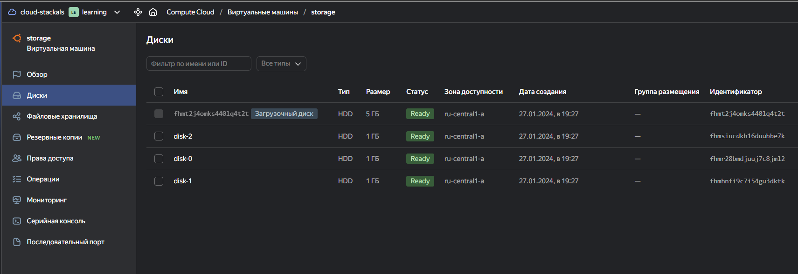
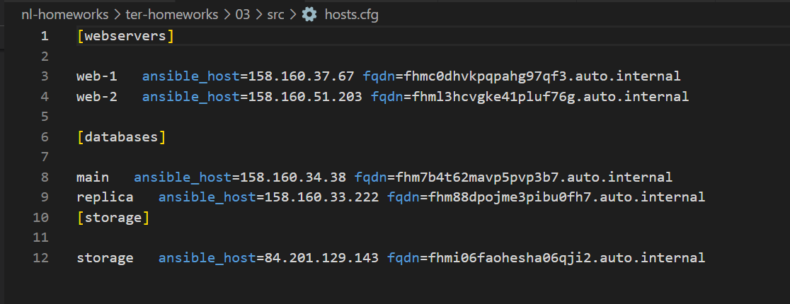
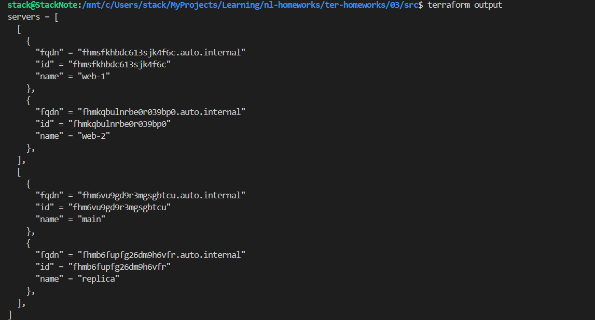

# Домашняя работа к занятию «Управляющие конструкции в коде Terraform»

## Задание 1

```bash
terraform init
terraform apply
```


## Задание 2

1. Добавлен файл [count-vm.tf](./src/count-vm.tfcount-vm.tf)
  
  

2. Добавлен файл [for_each-vm.tf](./src/for_each-vm.tf).
  Добавлена переменная `each_vm` в файл [vm_platform.tf](./src/vm_platform.tf)

3. Добавлена зависимость `web` серверов от `db` серверов

    ```bash
      depends_on = [ yandex_compute_instance.platform-db ]
    ```

4. Добавлена переменная `local ssh_keys` для переменной `metadata` c использованием функции `file`

    ```bash
    locals {
      ssh-keys  = "ubuntu:${file("~/.ssh/nl-ya-ed25519.pub")}"
    }

    metadata = {
        serial-port-enable = each.value.serial_port
        ssh-keys  = local.ssh-keys
    }
    ```

    Использование переменной `metadata` взятой из ДЗ 2 [vms_platform.tf](../02/src/vms_platform.tf) в таком случае невозможно, т.к. при определении значения `default` нельзя указывать другие переменные. [Documentation - variables default-values](https://developer.hashicorp.com/terraform/language/values/variables#default-values).

5. Проект запущен


## Задание 3

Добавлен файл [disk_vm.tf](./src/disk_vm.tf) и [disk_variables.tf](./src/disk_variables.tf) для создания виртуальных дисков с помощью ресурса `yandex_compute_disk` и виртуальной машины `storage`



## Задание 4

Создан файл [ansible.tf](./src/ansible.tf) для автоматического создания inventory-файла для ansible с использованием функции `tepmplatefile` и файл-шаблон [hoasts.tftpl](./src/hosts.tftpl) для создания ansible inventory-файла.



## Дополнительные задания (со звездочкой*)

### Задание 5* (необязательное)

[outputs.tf](./src/outputs.tf)



### Задание 6* (необязательное)

[ansible.tf](./src/ansible.tf) добавлен `resource "null_resource" "nginx"`

[hosts.tftpl](./src/hosts.tftpl). Необходимо отредактировать переменную ```ansible_host="<внешний IP-address или внутренний IP-address если у ВМ отсутвует внешний адрес>```.

Для проверки работы убран storage ВМ внешний адрес(nat=false).
[hosts.cfg](./src/hosts.cfg)
