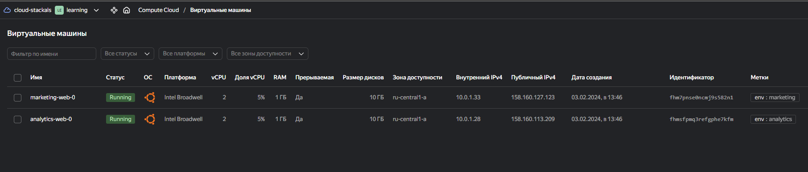
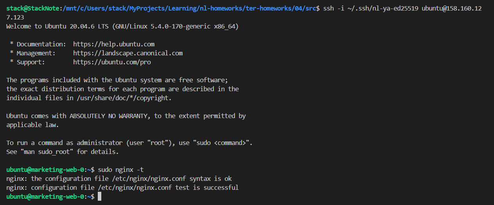
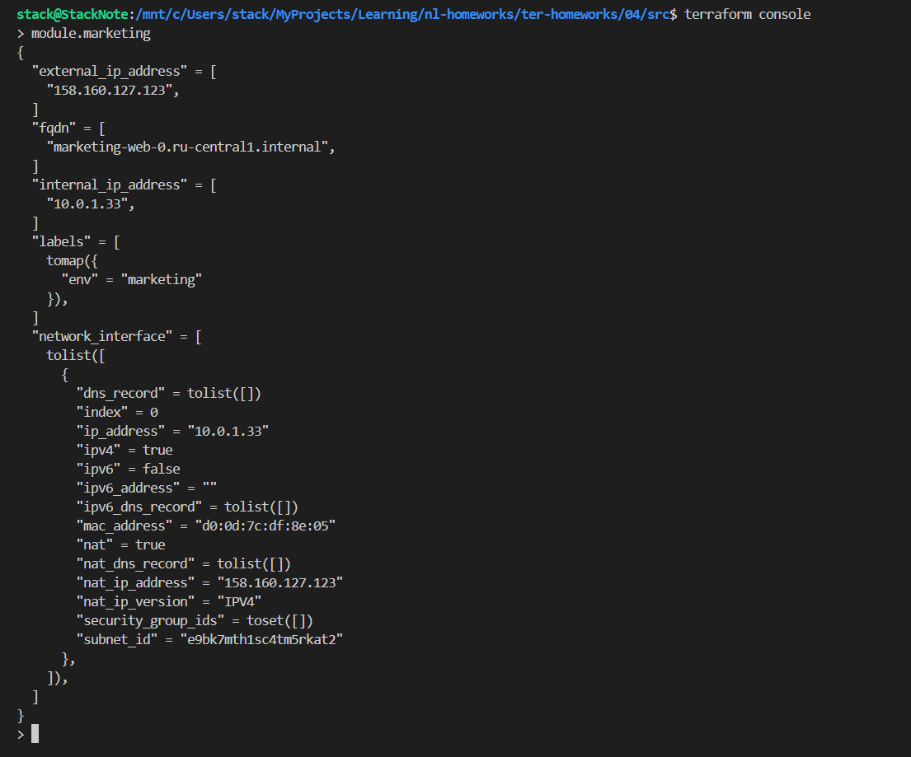
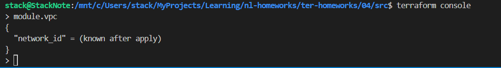
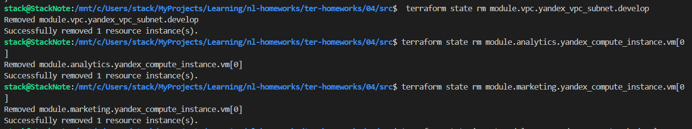
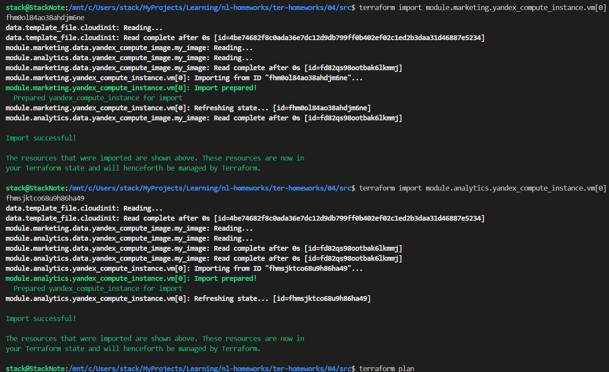
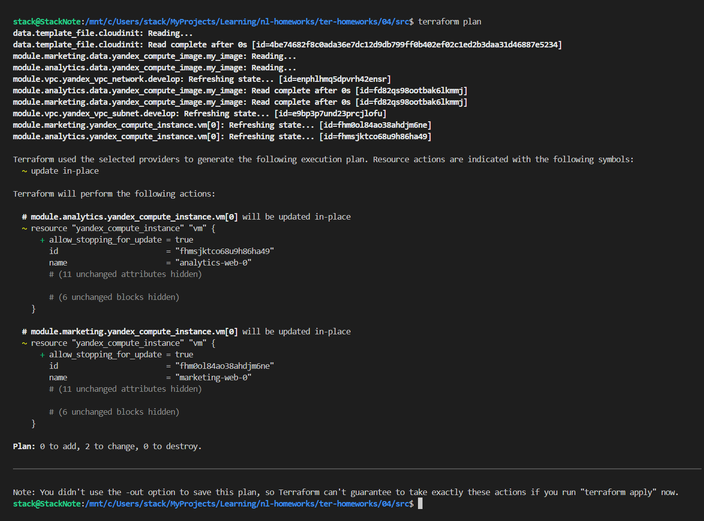

# Домашняя работа к занятию «Продвинутые методы работы с Terraform»

## Задание 1







## Задание 2

Написан локальный модуль vpc, который создаёт два ресурса: **одну** сеть и **одну** подсеть в зоне `ru-central1-a`.
В модуль передаются переменные с названием сети, zone и v4_cidr_blocks. Из модуля возвоащается `network_id` создаваемой сети и `subnet_id` подсети.

```bash
terraform init

# Заменить в main.tf
  # network_id     = yandex_vpc_network.develop.id
  network_id = module.vpc.network_id
  # subnet_ids     = [yandex_vpc_subnet.develop.id]
  subnet_ids = [module.vpc.subnet_id]

terraform apply

terraform console
> module.vpc
{
  "network_id" = "enphlhmq5dpvrh42ensr"
  "subnet_id" = "e9bp3p7und23prcjlofu"
}
>
```

Произведена генерация документации в модуле [vpc readme.md](./src/vpc/readme.md) и в проекте [modules.md](./src/modules.md)

```bash
stack@StackNote:/mnt/c/Users/stack/MyProjects/Learning/nl-homeworks/ter-homeworks/04/src/vpc$ docker run --rm --volume "$(pwd):/terraform-docs" -u $(id -u) quay.io/terraform-docs/terraform-docs:0.17.0 markdown /terraform-docs > readme.md
stack@StackNote:/mnt/c/Users/stack/MyProjects/Learning/nl-homeworks/ter-homeworks/04/src$ docker run --rm --volume "$(pwd):/terraform-docs" -u $(id -u) quay.io/terraform-docs/terraform-docs:0.17.0 markdown /terraform-docs > modules.md
```



## Задание 3

```bash
terraform state list
data.template_file.cloudinit
module.analytics.data.yandex_compute_image.my_image
module.analytics.yandex_compute_instance.vm[0]
module.marketing.data.yandex_compute_image.my_image
module.marketing.yandex_compute_instance.vm[0]
module.vpc.yandex_vpc_network.develop
module.vpc.yandex_vpc_subnet.develop

terraform state show module.vpc.yandex_vpc_network.develop | grep id
id = "enphlhmq5dpvrh42ensr"

terraform state show module.vpc.yandex_vpc_subnet.develop | grep id
id = "e9bp3p7und23prcjlofu"

terraform state show module.analytics.yandex_compute_instance.vm[0] | grep id
id = "fhmsjktco68u9h86ha49"

terraform state show module.marketing.yandex_compute_instance.vm[0] | grep id
id = "fhm0ol84ao38ahdjm6ne"

terraform import module.vpc.yandex_vpc_network.develop enphlhmq5dpvrh42ensr
terraform import module.vpc.yandex_vpc_subnet.develop e9bp3p7und23prcjlofu
terraform import module.marketing.yandex_compute_instance.vm[0] fhm0ol84ao38ahdjm6ne
terraform import module.analytics.yandex_compute_instance.vm[0] fhmsjktco68u9h86ha49

terraform plan

```





## Дополнительные задания (со звёздочкой*)

## Задание 4*

1. Измените модуль vpc так, чтобы он мог создать подсети во всех зонах доступности, переданных в переменной типа list(object) при вызове модуля.  
  
Пример вызова

```
module "vpc_prod" {
  source       = "./vpc"
  env_name     = "production"
  subnets = [
    { zone = "ru-central1-a", cidr = "10.0.1.0/24" },
    { zone = "ru-central1-b", cidr = "10.0.2.0/24" },
    { zone = "ru-central1-c", cidr = "10.0.3.0/24" },
  ]
}

module "vpc_dev" {
  source       = "./vpc"
  env_name     = "develop"
  subnets = [
    { zone = "ru-central1-a", cidr = "10.0.1.0/24" },
  ]
}
```

Предоставьте код, план выполнения, результат из консоли YC.

### Задание 5*

1. Напишите модуль для создания кластера managed БД Mysql в Yandex Cloud с одним или несколькими(2 по умолчанию) хостами в зависимости от переменной HA=true или HA=false. Используйте ресурс yandex_mdb_mysql_cluster: передайте имя кластера и id сети.
2. Напишите модуль для создания базы данных и пользователя в уже существующем кластере managed БД Mysql. Используйте ресурсы yandex_mdb_mysql_database и yandex_mdb_mysql_user: передайте имя базы данных, имя пользователя и id кластера при вызове модуля.
3. Используя оба модуля, создайте кластер example из одного хоста, а затем добавьте в него БД test и пользователя app. Затем измените переменную и превратите сингл хост в кластер из 2-х серверов.
4. Предоставьте план выполнения и по возможности результат. Сразу же удаляйте созданные ресурсы, так как кластер может стоить очень дорого. Используйте минимальную конфигурацию.

### Задание 6*

1. Используя готовый yandex cloud terraform module и пример его вызова(examples/simple-bucket): <https://github.com/terraform-yc-modules/terraform-yc-s3> .
Создайте и не удаляйте для себя s3 бакет размером 1 ГБ(это бесплатно), он пригодится вам в ДЗ к 5 лекции.

### Задание 7*

1. Разверните у себя локально vault, используя docker-compose.yml в проекте.
2. Для входа в web-интерфейс и авторизации terraform в vault используйте токен "education".
3. Создайте новый секрет по пути <http://127.0.0.1:8200/ui/vault/secrets/secret/create>
Path: example  
secret data key: test
secret data value: congrats!  
4. Считайте этот секрет с помощью terraform и выведите его в output по примеру:

```
provider "vault" {
 address = "http://<IP_ADDRESS>:<PORT_NUMBER>"
 skip_tls_verify = true
 token = "education"
}
data "vault_generic_secret" "vault_example"{
 path = "secret/example"
}

output "vault_example" {
 value = "${nonsensitive(data.vault_generic_secret.vault_example.data)}"
} 

Можно обратиться не к словарю, а конкретному ключу:
terraform console: >nonsensitive(data.vault_generic_secret.vault_example.data.<имя ключа в секрете>)
```

5. Попробуйте самостоятельно разобраться в документации и записать новый секрет в vault с помощью terraform.

### Задание 8*

Попробуйте самостоятельно разобраться в документаци и с помощью terraform remote state разделить root модуль на два отдельных root-модуля: создание VPC , создание ВМ .

### Правила приёма работы

В своём git-репозитории создайте новую ветку terraform-04, закоммитьте в эту ветку свой финальный код проекта. Ответы на задания и необходимые скриншоты оформите в md-файле в ветке terraform-04.

В качестве результата прикрепите ссылку на ветку terraform-04 в вашем репозитории.

**Важно.** Удалите все созданные ресурсы.

### Критерии оценки

Зачёт ставится, если:

* выполнены все задания,
* ответы даны в развёрнутой форме,
* приложены соответствующие скриншоты и файлы проекта,
* в выполненных заданиях нет противоречий и нарушения логики.

На доработку работу отправят, если:

* задание выполнено частично или не выполнено вообще,
* в логике выполнения заданий есть противоречия и существенные недостатки.
