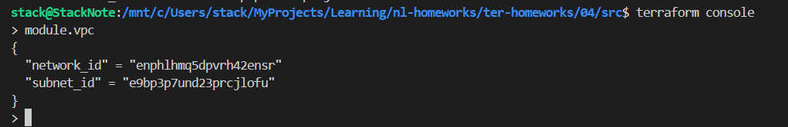
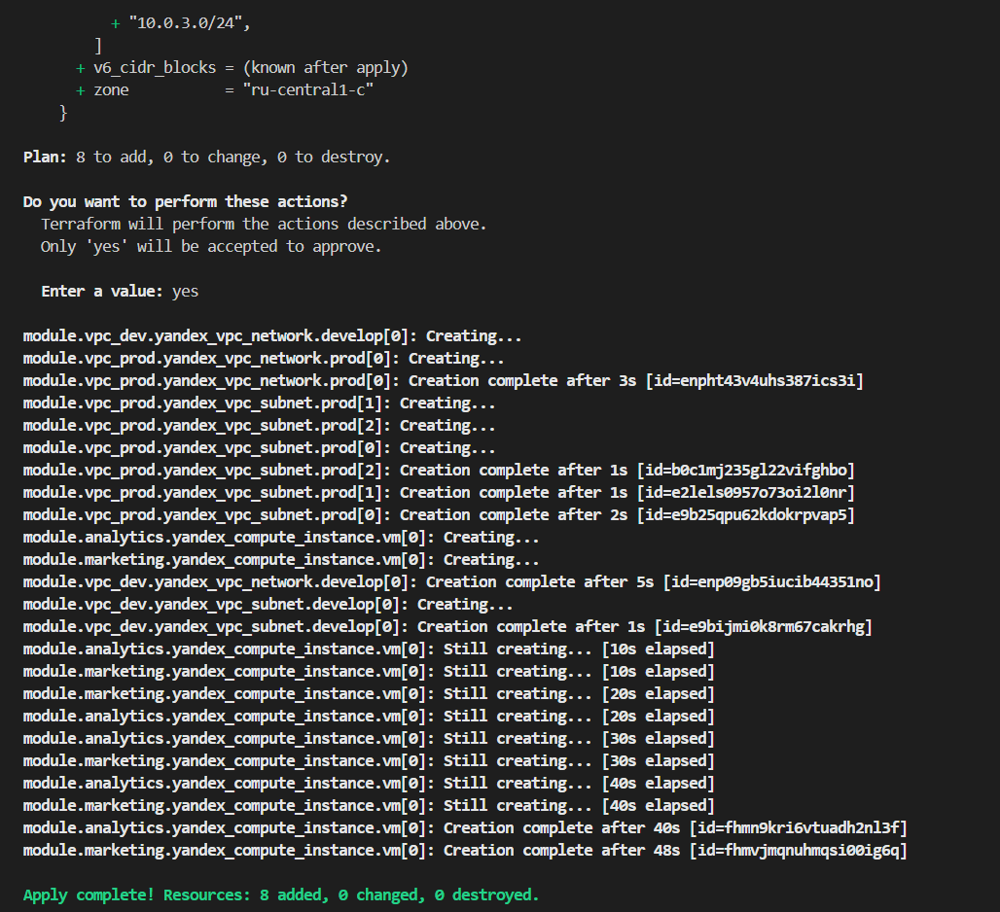
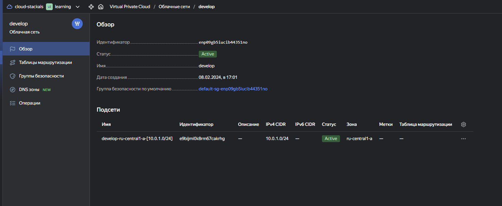
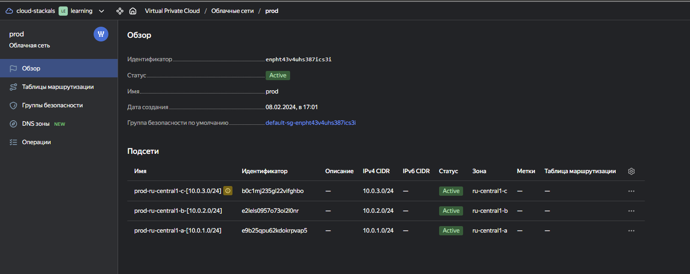

# Домашняя работа к занятию «Продвинутые методы работы с Terraform»

## Задание 1


## Задание 2

Написан локальный модуль vpc, который создаёт два ресурса: **одну** сеть и **одну** подсеть в зоне `ru-central1-a`.
В модуль передаются переменные с названием сети, zone и v4_cidr_blocks. Из модуля возвоащается `network_id` создаваемой сети и `subnet_id` подсети.

```bash
terraform init

# Заменить в main.tf
  # network_id     = yandex_vpc_network.develop.id
  network_id = module.vpc.network_id
  # subnet_ids     = [yandex_vpc_subnet.develop.id]
  subnet_ids = [module.vpc.subnet_id]

terraform apply

terraform console
> module.vpc
{
  "network_id" = "enphlhmq5dpvrh42ensr"
  "subnet_id" = "e9bp3p7und23prcjlofu"
}
>
```

Произведена генерация документации в модуле [vpc readme.md](./src/vpc/readme.md) и в проекте [modules.md](./src/modules.md)

```bash
stack@StackNote:/mnt/c/Users/stack/MyProjects/Learning/nl-homeworks/ter-homeworks/04/src/vpc$ docker run --rm --volume "$(pwd):/terraform-docs" -u $(id -u) quay.io/terraform-docs/terraform-docs:0.17.0 markdown /terraform-docs > readme.md
stack@StackNote:/mnt/c/Users/stack/MyProjects/Learning/nl-homeworks/ter-homeworks/04/src$ docker run --rm --volume "$(pwd):/terraform-docs" -u $(id -u) quay.io/terraform-docs/terraform-docs:0.17.0 markdown /terraform-docs > modules.md
```



## Задание 3

```bash
terraform state list
data.template_file.cloudinit
module.analytics.data.yandex_compute_image.my_image
module.analytics.yandex_compute_instance.vm[0]
module.marketing.data.yandex_compute_image.my_image
module.marketing.yandex_compute_instance.vm[0]
module.vpc.yandex_vpc_network.develop
module.vpc.yandex_vpc_subnet.develop

terraform state show module.vpc.yandex_vpc_network.develop | grep id
id = "enphlhmq5dpvrh42ensr"

terraform state show module.vpc.yandex_vpc_subnet.develop | grep id
id = "e9bp3p7und23prcjlofu"

terraform state show module.analytics.yandex_compute_instance.vm[0] | grep id
id = "fhmsjktco68u9h86ha49"

terraform state show module.marketing.yandex_compute_instance.vm[0] | grep id
id = "fhm0ol84ao38ahdjm6ne"

terraform import module.vpc.yandex_vpc_network.develop enphlhmq5dpvrh42ensr
terraform import module.vpc.yandex_vpc_subnet.develop e9bp3p7und23prcjlofu
terraform import module.marketing.yandex_compute_instance.vm[0] fhm0ol84ao38ahdjm6ne
terraform import module.analytics.yandex_compute_instance.vm[0] fhmsjktco68u9h86ha49

terraform plan

```


## Дополнительные задания (со звёздочкой*)

## Задание 4*

Модуль vpc изменен, чтобы он мог создать подсети во всех зонах доступности, переданных в переменной типа list(object) при вызове модуля.  
  
```bash
terraform console
> module.vpc_dev
{
  "network_id_dev" = [
    "enp09gb5iucib44351no",
  ]
  "network_id_prod" = (known after apply)
  "subnet_id_dev" = [
    "e9bijmi0k8rm67cakrhg",
  ]
  "subnet_id_prod" = (known after apply)
}
> module.vpc_prod
{
  "network_id_dev" = (known after apply)
  "network_id_prod" = [
    "enpht43v4uhs387ics3i",
  ]
  "subnet_id_dev" = (known after apply)
  "subnet_id_prod" = [
    "e9b25qpu62kdokrpvap5",
    "e2lels0957o73oi2l0nr",
    "b0c1mj235gl22vifghbo",
  ]
}
```





К сожалению на остальные звездочки не хватило времени. ((
