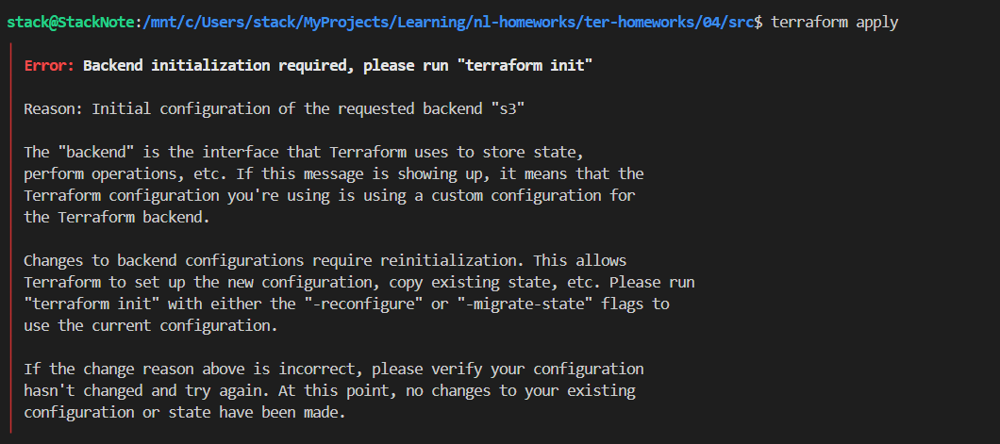
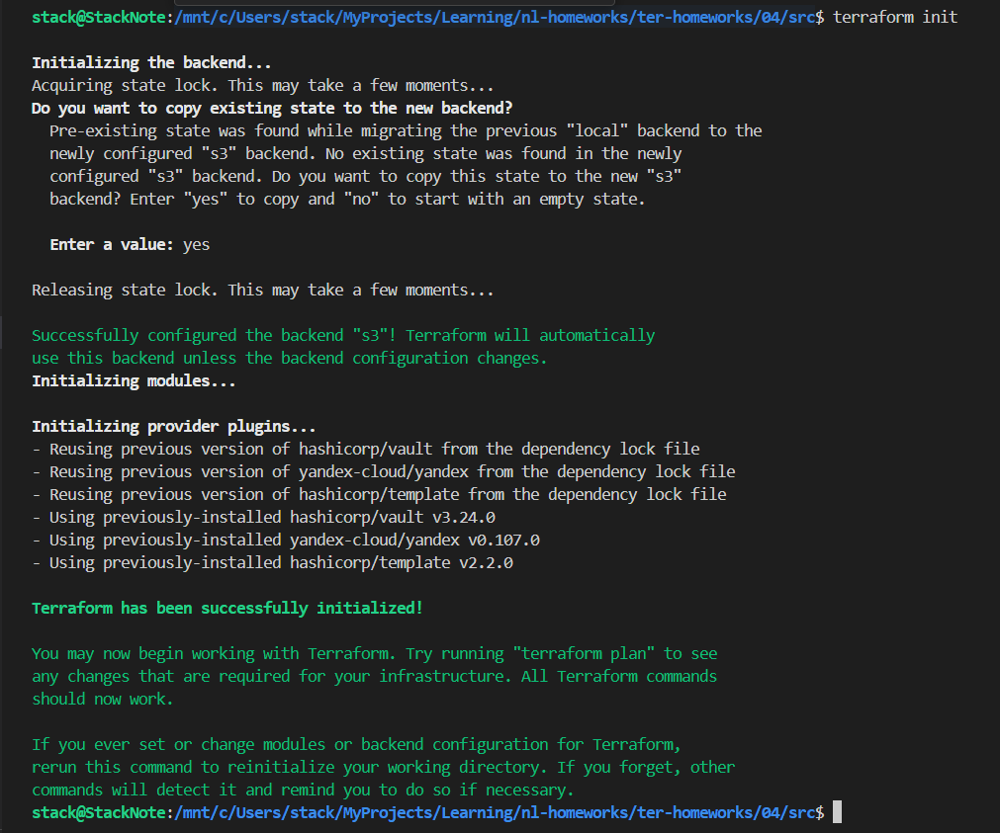
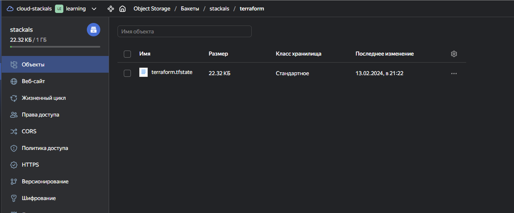
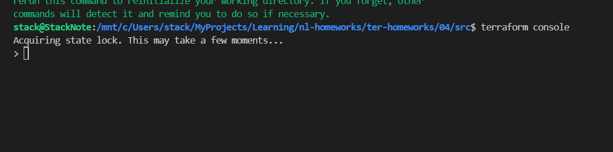
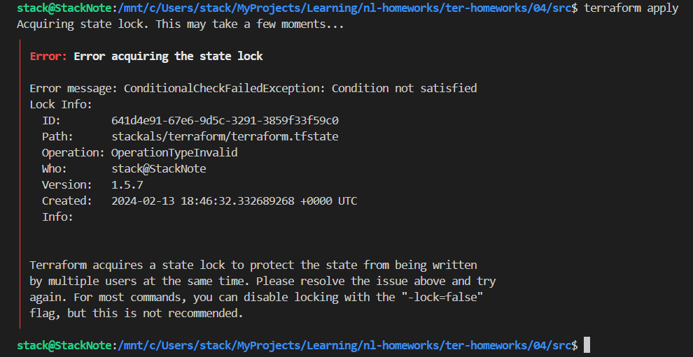
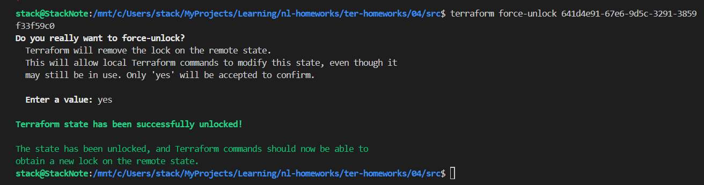

# Домашняя работа к занятию «Использование Terraform в команде»

## Задание 1

### Сканирование проекта и демо к лекции 4

```bash
docker run --rm --name test-tflint -v $(pwd):/data ghcr.io/terraform-linters/tflint
8 issue(s) found:

Warning: Module source "git::https://github.com/udjin10/yandex_compute_instance.git?ref=main" uses a default branch as ref (main) (terraform_module_pinned_source)

  on main.tf line 32:
  32:   source   = "git::https://github.com/udjin10/yandex_compute_instance.git?ref=main"

Reference: https://github.com/terraform-linters/tflint-ruleset-terraform/blob/v0.5.0/docs/rules/terraform_module_pinned_source.md

Warning: Module source "git::https://github.com/udjin10/yandex_compute_instance.git?ref=main" uses a default branch as ref (main) (terraform_module_pinned_source)

  on main.tf line 56:
  56:   source   = "git::https://github.com/udjin10/yandex_compute_instance.git?ref=main"

Reference: https://github.com/terraform-linters/tflint-ruleset-terraform/blob/v0.5.0/docs/rules/terraform_module_pinned_source.md

Warning: Missing version constraint for provider "template" in `required_providers` (terraform_required_providers)

  on main.tf line 79:
  79: data "template_file" "cloudinit" {

Reference: https://github.com/terraform-linters/tflint-ruleset-terraform/blob/v0.5.0/docs/rules/terraform_required_providers.md

Warning: Missing version constraint for provider "yandex" in `required_providers` (terraform_required_providers)

  on providers.tf line 3:
   3:     yandex = {
   4:       source = "yandex-cloud/yandex"
   5:     }

Reference: https://github.com/terraform-linters/tflint-ruleset-terraform/blob/v0.5.0/docs/rules/terraform_required_providers.md

Warning: Missing version constraint for provider "vault" in `required_providers` (terraform_required_providers)

  on providers.tf line 24:
  24: provider "vault" {

Reference: https://github.com/terraform-linters/tflint-ruleset-terraform/blob/v0.5.0/docs/rules/terraform_required_providers.md

Warning: [Fixable] variable "default_cidr" is declared but not used (terraform_unused_declarations)

  on variables.tf line 22:
  22: variable "default_cidr" {

Reference: https://github.com/terraform-linters/tflint-ruleset-terraform/blob/v0.5.0/docs/rules/terraform_unused_declarations.md

Warning: [Fixable] variable "vpc_name" is declared but not used (terraform_unused_declarations)

  on variables.tf line 28:
  28: variable "vpc_name" {

Reference: https://github.com/terraform-linters/tflint-ruleset-terraform/blob/v0.5.0/docs/rules/terraform_unused_declarations.md

Warning: [Fixable] Interpolation-only expressions are deprecated in Terraform v0.12.14 (terraform_deprecated_interpolation)

  on vault.tf line 6:
   6:  value = "${nonsensitive(data.vault_generic_secret.vault_example.data)}"

Reference: https://github.com/terraform-linters/tflint-ruleset-terraform/blob/v0.5.0/docs/rules/terraform_deprecated_interpolation.md
```

```bash
docker run --rm --tty --volume $(pwd):/tf --workdir /tf bridgecrew/checkov --download-external-modules true --directory /tf

       _               _
   ___| |__   ___  ___| | _______   __
  / __| '_ \ / _ \/ __| |/ / _ \ \ / /
 | (__| | | |  __/ (__|   < (_) \ V /
  \___|_| |_|\___|\___|_|\_\___/ \_/

By Prisma Cloud | version: 3.2.20

terraform scan results:

Passed checks: 2, Failed checks: 6, Skipped checks: 0

Check: CKV_YC_4: "Ensure compute instance does not have serial console enabled."
        PASSED for resource: module.analytics.yandex_compute_instance.vm[0]
        File: /.external_modules/github.com/udjin10/yandex_compute_instance/main/main.tf:24-73
        Calling File: /main.tf:55-77
Check: CKV_YC_4: "Ensure compute instance does not have serial console enabled."
        PASSED for resource: module.marketing.yandex_compute_instance.vm[0]
        File: /.external_modules/github.com/udjin10/yandex_compute_instance/main/main.tf:24-73
        Calling File: /main.tf:31-53
Check: CKV_YC_2: "Ensure compute instance does not have public IP."
        FAILED for resource: module.analytics.yandex_compute_instance.vm[0]
        File: /.external_modules/github.com/udjin10/yandex_compute_instance/main/main.tf:24-73
        Calling File: /main.tf:55-77

                Code lines for this resource are too many. Please use IDE of your choice to review the file.
Check: CKV_YC_11: "Ensure security group is assigned to network interface."
        FAILED for resource: module.analytics.yandex_compute_instance.vm[0]
        File: /.external_modules/github.com/udjin10/yandex_compute_instance/main/main.tf:24-73
        Calling File: /main.tf:55-77

                Code lines for this resource are too many. Please use IDE of your choice to review the file.
Check: CKV_YC_2: "Ensure compute instance does not have public IP."
        FAILED for resource: module.marketing.yandex_compute_instance.vm[0]
        File: /.external_modules/github.com/udjin10/yandex_compute_instance/main/main.tf:24-73
        Calling File: /main.tf:31-53

                Code lines for this resource are too many. Please use IDE of your choice to review the file.
Check: CKV_YC_11: "Ensure security group is assigned to network interface."
        FAILED for resource: module.marketing.yandex_compute_instance.vm[0]
        File: /.external_modules/github.com/udjin10/yandex_compute_instance/main/main.tf:24-73
        Calling File: /main.tf:31-53

                Code lines for this resource are too many. Please use IDE of your choice to review the file.
Check: CKV_TF_1: "Ensure Terraform module sources use a commit hash"
        FAILED for resource: marketing
        File: /main.tf:31-53
        Guide: https://docs.prismacloud.io/en/enterprise-edition/policy-reference/supply-chain-policies/terraform-policies/ensure-terraform-module-sources-use-git-url-with-commit-hash-revision

                Code lines for this resource are too many. Please use IDE of your choice to review the file.

Check: CKV_TF_1: "Ensure Terraform module sources use a commit hash"
        FAILED for resource: analytics
        File: /main.tf:55-77
        Guide: https://docs.prismacloud.io/en/enterprise-edition/policy-reference/supply-chain-policies/terraform-policies/ensure-terraform-module-sources-use-git-url-with-commit-hash-revision

                Code lines for this resource are too many. Please use IDE of your choice to review the file.

secrets scan results:

Passed checks: 0, Failed checks: 0, Skipped checks: 1

Check: CKV_SECRET_6: "Base64 High Entropy String"
        SKIPPED for resource: 24e7451df05ed5cd4cf1041be67c68f8d89d087a
        Suppress comment:  education
        File: /providers.tf:27-28
        Guide: https://docs.prismacloud.io/en/enterprise-edition/policy-reference/secrets-policies/secrets-policy-index/git-secrets-6

```

По результатам сканирования выявлены ошибки:
    - не зафиксирован конкретный коммит кода используемый в модулях (это может привести к неверной работе при изменении кода модуля)
    - не зафиксирована версия провайдеров
    - присутствуют не используемые переменные
    - используются устаревшие конструкции кода terraform
    - рекомендации отключить serial console и внешний IP для создаваемых ВМ.

## Задание 2

Добавлено хранение tfstste в s3 бакет и блокировка в YDB.
[branch terraform-05]()





```bash
terraform console
>
 # в другой консоли
terraform apply
Acquiring state lock. This may take a few moments...
╷
│ Error: Error acquiring the state lock
│
│ Error message: ConditionalCheckFailedException: Condition not satisfied
│ Lock Info:
│   ID:        641d4e91-67e6-9d5c-3291-3859f33f59c0
│   Path:      stackals/terraform/terraform.tfstate
│   Operation: OperationTypeInvalid
│   Who:       stack@StackNote
│   Version:   1.5.7
│   Created:   2024-02-13 18:46:32.332689268 +0000 UTC
│   Info:
│
│
│ Terraform acquires a state lock to protect the state from being written
│ by multiple users at the same time. Please resolve the issue above and try
│ again. For most commands, you can disable locking with the "-lock=false"
│ flag, but this is not recommended.

# принудительная однократная разблокировка
terraform apply -lock=false
# перманентная разблокировка (ID из вывода команды выше)
terraform force-unlock 641d4e91-67e6-9d5c-3291-3859f33f59c0
```






1. Возьмите ваш GitHub-репозиторий с **выполненным ДЗ 4** в ветке 'terraform-04' и сделайте из него ветку 'terraform-05'.
2. Повторите демонстрацию лекции: настройте YDB, S3 bucket, yandex service account, права доступа и мигрируйте state проекта в S3 с блокировками. Предоставьте скриншоты процесса в качестве ответа.
3. Закоммитьте в ветку 'terraform-05' все изменения.
4. Откройте в проекте terraform console, а в другом окне из этой же директории попробуйте запустить terraform apply.
5. Пришлите ответ об ошибке доступа к state.
6. Принудительно разблокируйте state. Пришлите команду и вывод.

------

### Задание 3  

1. Сделайте в GitHub из ветки 'terraform-05' новую ветку 'terraform-hotfix'.
2. Проверье код с помощью tflint и checkov, исправьте все предупреждения и ошибки в 'terraform-hotfix', сделайте коммит.
3. Откройте новый pull request 'terraform-hotfix' --> 'terraform-05'.
4. Вставьте в комментарий PR результат анализа tflint и checkov, план изменений инфраструктуры из вывода команды terraform plan.
5. Пришлите ссылку на PR для ревью. Вливать код в 'terraform-05' не нужно.

------

### Задание 4

1. Напишите переменные с валидацией и протестируйте их, заполнив default верными и неверными значениями. Предоставьте скриншоты проверок из terraform console.

- type=string, description="ip-адрес" — проверка, что значение переменной содержит верный IP-адрес с помощью функций cidrhost() или regex(). Тесты:  "192.168.0.1" и "1920.1680.0.1";
- type=list(string), description="список ip-адресов" — проверка, что все адреса верны. Тесты:  ["192.168.0.1", "1.1.1.1", "127.0.0.1"] и ["192.168.0.1", "1.1.1.1", "1270.0.0.1"].

## Дополнительные задания (со звёздочкой*)

**Настоятельно рекомендуем выполнять все задания со звёздочкой.** Их выполнение поможет глубже разобраться в материале.
Задания со звёздочкой дополнительные, не обязательные к выполнению и никак не повлияют на получение вами зачёта по этому домашнему заданию
------

### Задание 5*

1. Напишите переменные с валидацией:

- type=string, description="любая строка" — проверка, что строка не содержит символов верхнего регистра;
- type=object — проверка, что одно из значений равно true, а второе false, т. е. не допускается false false и true true:

```
variable "in_the_end_there_can_be_only_one" {
    description="Who is better Connor or Duncan?"
    type = object({
        Dunkan = optional(bool)
        Connor = optional(bool)
    })

    default = {
        Dunkan = true
        Connor = false
    }

    validation {
        error_message = "There can be only one MacLeod"
        condition = <проверка>
    }
}
```

------

### Задание 6*

1. Настройте любую известную вам CI/CD-систему. Если вы ещё не знакомы с CI/CD-системами, настоятельно рекомендуем вернуться к этому заданию после изучения Jenkins/Teamcity/Gitlab.
2. Скачайте с её помощью ваш репозиторий с кодом и инициализируйте инфраструктуру.
3. Уничтожьте инфраструктуру тем же способом.

------

### Задание 7*

1. Настройте отдельный terraform root модуль, который будет создавать YDB, s3 bucket для tfstate и сервисный аккаунт с необходимыми правами.

### Правила приёма работы

Ответы на задания и необходимые скриншоты оформите в md-файле в ветке terraform-05.

В качестве результата прикрепите ссылку на ветку terraform-05 в вашем репозитории.

**Важно.** Удалите все созданные ресурсы.

### Критерии оценки

Зачёт ставится, если:

- выполнены все задания,
- ответы даны в развёрнутой форме,
- приложены соответствующие скриншоты и файлы проекта,
- в выполненных заданиях нет противоречий и нарушения логики.

На доработку работу отправят, если:

- задание выполнено частично или не выполнено вообще,
- в логике выполнения заданий есть противоречия и существенные недостатки.
